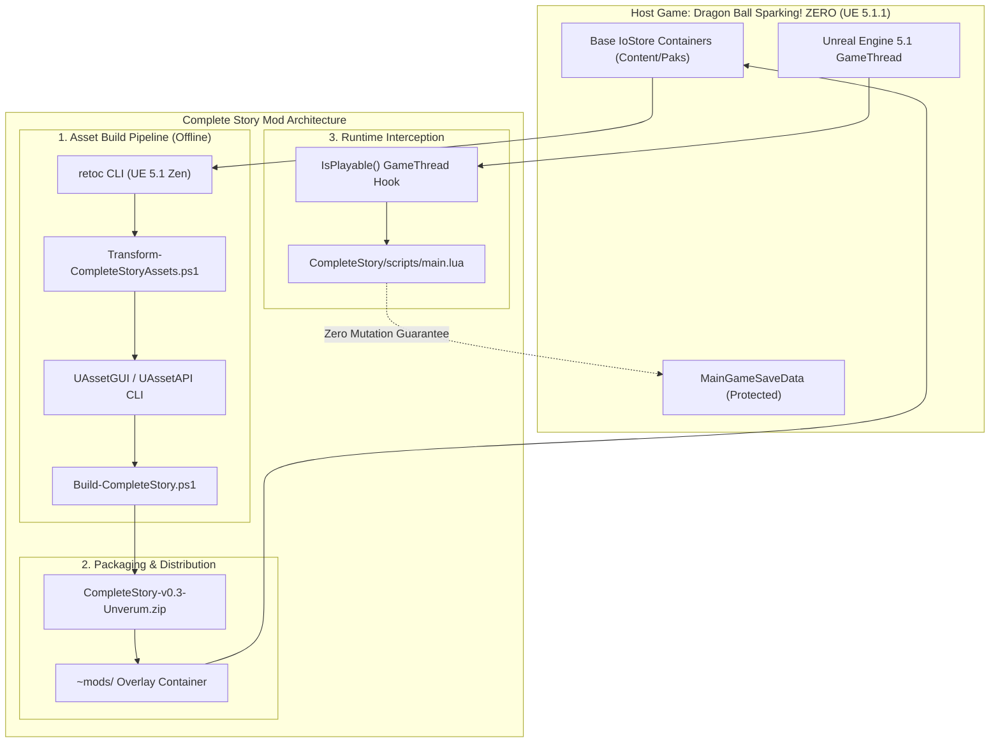
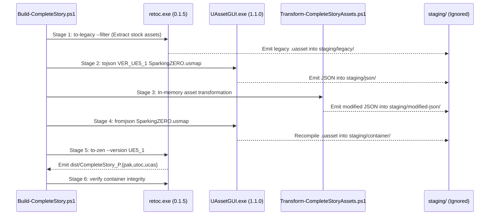

# Complete Story: System Architecture Document

> **Status:** APPROVED & AUTHORITATIVE  
> **Informed By:** `docs/PRD.md` (Master Product Requirements Document)  
> **Governance:** `AGENTS.md` §3.1 (Architecture strictly follows PRD)

---

## 1. System Overview & Architectural Principles

The **Sparking ZERO: Complete Story** system is a non-destructive total conversion campaign mod for *Dragon Ball: Sparking! ZERO*. It introduces an independent, chronologically unified single-player campaign featuring **Goku (Mini)** alongside the game's 12 stock Episode Battle campaigns.



### Core Architectural Invariants
1. **Non-Destructive Coexistence:** Stock campaigns (`0000_40` through `0930_00`) and the player's vanilla save data (`MainGameSaveData`) must remain completely untouched.
2. **Separation of Concerns:** Pure in-memory asset mutation is decoupled from external tool subprocess execution (ADR 0003).
3. **Engine Memory Safety:** Playability is resolved via native UFunction hooks on GameThread; transient Slate widget reflection is strictly prohibited (ADR 0004).
4. **Community Tool Delegation:** Container packing and mod distribution are delegated to verified community tools (`retoc`, `Unverum`) without custom manifests (ADR 0002).

### 1.2 System Composition & Community Archetype Boundaries

By auditing the wider modding ecosystem ([`sparking-zero-modding-ecosystem.md`](research/case-studies/sparking-zero-modding-ecosystem.md)), Complete Story is architecturally designed as a **Hybrid System bridging two community archetypes**:

```text
COMPLETE STORY HYBRID ARCHITECTURE
├── 1. OFFLINE DATA SPLICER (Community Archetype C - LostImbecile Pattern)
│   └── helpers/Build-CompleteStory.ps1 & Transform-CompleteStoryAssets.ps1
│       └── Domain: 100% responsible for CONTENT (tables, route nodes, event graphs)
│
└── 2. IN-ENGINE RUNTIME HOOK (Community Archetype A - AccessForge Pattern)
    └── CompleteStory/scripts/main.lua
        └── Domain: 100% responsible for BEHAVIOR (menu focus, unlocking, save safety)
```

#### Strict Responsibility Boundaries (Anti-Drift Guardrails)
1. **Never Solve Content Problems in Lua:** Do not write runtime scripts that attempt to synthesize cutscene events, battle conditions, or character data in memory. This causes native engine crashes (`0xC0000005`). Content must be serialized into IoStore containers offline via Subsystem 1.
2. **Never Solve Behavior Problems in the `.pak`:** Do not assume mounting a container is sufficient to launch a custom campaign. The game's native C++ menu code ignores unlisted character keys without Subsystem 3's runtime hook forcing focus to Goku (Mini).
3. **Archetype B Guardrail (Anti-Hallucination Gate):**
   * *Status:* **STRICTLY OUT OF SCOPE.**
   * *Rationale:* Goku (Mini) character assets, 3D meshes, skeleton rigs, voice lines, and animations are already present in vanilla retail game files.
   * *Extension Criteria:* Mod authoring via Unreal Engine SDK projects (Archetype B) is only permitted if a formal requirement introduces non-vanilla 3D models or custom skeletal animations. Agents are strictly barred from introducing Unreal Editor dependencies for data-only modifications.

---

## 2. Subsystem Decomposition

The architecture is decomposed into four discrete, single-responsibility subsystems:

```text
COMPLETE STORY SYSTEM
├── Subsystem 1: Asset Build Pipeline       (helpers/Build-CompleteStory.ps1)
├── Subsystem 2: Packaging & Distribution   (dist/CompleteStory-v0.3-Unverum.zip)
├── Subsystem 3: Runtime Interception       (CompleteStory/scripts/main.lua)
└── Subsystem 4: Save & Coexistence Layer   (Isolated Memory Hooking)
```

---

### 2.1 Subsystem 1: Asset Build Pipeline (Offline Transformation)
The Asset Build Pipeline transforms stock game data assets into a custom UE5.1 IoStore overlay container through an automated 6-stage lifecycle:



* **Contract & Staging Isolation:** All intermediate artifacts reside exclusively within `staging/` and `dist/`, which are excluded from Git via `.gitignore`.
* **Pure Domain Transformation (`Transform-CompleteStoryAssets.ps1`):**
  * Slices route key `0000_00` into `DragonAdventureIFData.PtrRecords` (preserving `DefaultOpenCharacter = 0000_40`).
  * Slices route key `0000_00` into `DragonAdventureIFChartData` pointing to `ChartData0000_00`.
  * Clones Goku's data into `DAIF_CharaData_CompleteStory` with culture-invariant name `"Complete Story"` and Raditz start event pointers (`Event_00_0_00_00`, `EventBlock_0000_00`, `DIF_Event_0000_00`).

---

### 2.2 Subsystem 2: Packaging & Distribution
* **Container Standards:** Built using `retoc to-zen --version UE5_1`. Produces standard nine-character indexed IoStore containers: `CompleteStory_P.pak`, `CompleteStory_P.utoc`, `CompleteStory_P.ucas`.
* **Distribution Archive:** Generates `dist/CompleteStory-v0.3-Unverum.zip` containing strictly the container files at the archive root.
* **Mod Manager Integration:** Installed via **Unverum**, which automatically handles mod mounting, priority renaming (`~mods/`), and signature bypass loading (`dsound.dll` + `.asi`). Mod release zips **never bundle third-party bypass DLLs** (ADR 0002).

---

### 2.3 Subsystem 3: Runtime Interception (RE-UE4SS Lua)
* **Execution Environment:** RE-UE4SS v3.0.1 Beta (`4e5461c`) embedded in the game process.
* **Component Path:** `CompleteStory/scripts/main.lua`
* **Interception Architecture:**
  * Hooks the native parameterless UFunction `SSDragonAdventureIFCSManager::IsPlayable()`.
  * Evaluates whether the currently focused campaign route corresponds to `0000_00`.
  * When `0000_00` is queried, forces the return value to `true` (unlocked).
  * Game receives a valid playability signal, displays `New Game`, and dispatches the native travel request to Goku's Raditz opening event graph.
* **Memory Safety & Threading Constraints (ADR 0004):**
  * **Zero Slate Widget Reflection:** Scripts are strictly forbidden from calling `FindAllOf("TextBlock")` or traversing transient Slate/UMG widget hierarchies.
  * **Safe GameThread Scheduling:** All UObject lookups and function hooks execute synchronously on GameThread using `ExecuteInGameThread`.

---

### 2.4 Subsystem 4: Save Data & Coexistence Architecture
* **Vanilla Save Invariant:**
  * Vanilla game save data (`FSSDragonAdventureIFSaveData`) tracks unlocked campaigns in `CharacterPlayableData`.
  * The custom route `0000_00` does not exist in vanilla save files.
  * Runtime playability is granted **transiently in memory** by the UE4SS hook during menu selection.
  * No synthetic records are written to disk, ensuring that removing Complete Story leaves the player's stock save files 100% clean and uncorrupted.

---

## 3. Technology Stack & Authority Matrix

| Layer | Component | Authoritative Technology | SSOT Governance Reference |
| :--- | :--- | :--- | :--- |
| **Requirements** | Master Mod Scope & Vision | Markdown (`docs/PRD.md`) | `docs/PRD.md` |
| **Asset Extract & Pack** | IoStore Container Packaging | retoc v0.1.5 CLI (Rust) | `docs/dependencies/retoc/` |
| **Asset Serialization** | UAsset Binary <-> JSON | UAssetGUI v1.1.0 CLI (C#) | `docs/dependencies/uassetgui/` |
| **Asset Domain Logic** | JSON AST Transformation | PowerShell 7 / Windows PowerShell | `helpers/Transform-CompleteStoryAssets.ps1` |
| **Pipeline Automation** | Master Build Orchestration | PowerShell (`helpers/Build-CompleteStory.ps1`) | `docs/ADRs/0003` |
| **Runtime Interception** | Native UFunction Hooking | RE-UE4SS v3.0.1 Beta (Lua 5.4) | `docs/dependencies/ue4ss/` & `docs/ADRs/0004` |
| **Mod Management** | Distribution & Load Ordering | Unverum Mod Manager | `docs/dependencies/unverum/` & `docs/ADRs/0002` |
| **Engine Target** | Host Executable Environment | Unreal Engine 5.1.1 (Zen / IoStore) | Steam Build `24953175` |

---

## 4. Verification & Quality Attributes

1. **Deterministic Buildability:** Running `.\helpers\Build-CompleteStory.ps1` from a clean clone with valid prerequisites produces a bit-for-bit verified container passing `retoc verify`.
2. **Crash Immunity:** Zero dereferencing of transient Slate widget memory; zero native access violations (`0xC0000005`).
3. **Maintainability Ceiling:** Every implementation script (`.ps1`, `.lua`) strictly adheres to the **<= 300 lines ceiling** (`AGENTS.md` §0.4). Architectural, research, and specification documents are exempt to ensure thorough and complete context.
