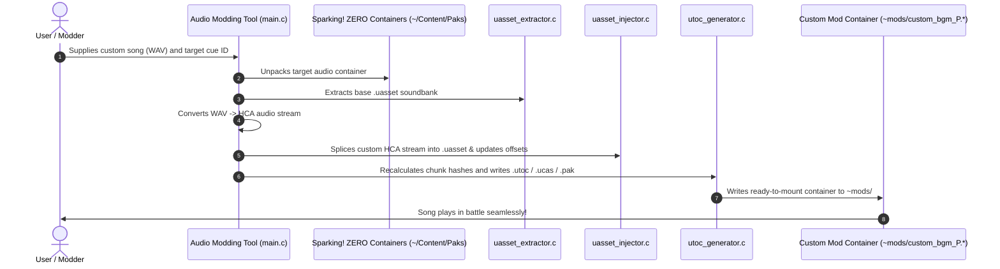

# Case Study: Audio Modding Tool (`LostImbecile`)

> **Subject:** [`LostImbecile/Sparking-Zero-Audio-Modding-Tool`](https://github.com/LostImbecile/Sparking-Zero-Audio-Modding-Tool) (Audited @ `main`)  
> **Domain:** Headless Binary Extraction & Splicing Toolchain (Automated C Pipeline)  
> **Target Game:** *Dragon Ball: Sparking! ZERO* (Unreal Engine 5.1.1, Criware Audio)  
> **Significance:** Authoritative blueprint for standalone CLI tools that programmatically extract, mutate, and rebuild binary assets and IoStore containers without opening Unreal Editor.

---

## 1. Executive Summary & Problem Context

In game modding, neither runtime Lua hooks (AccessForge) nor full Unreal Editor SDK projects (WistfulHopes) are ideal when you want to provide non-technical users with an automated one-click modification tool. 

Audio replacement is a prime example:
1. **Nested Proprietary Formats:** Game music in Sparking! ZERO is encoded in Criware HCA format, packed into Criware `.acb`/`.awb` soundbanks, and then encapsulated inside Unreal Engine `.uasset` binaries within encrypted `.utoc`/`.ucas` IoStore containers.
2. **Heavyweight Tool Friction:** Forcing users to download the 50GB Unreal Engine editor just to swap a background music track is impractical.
3. **Offset Recalculation:** Replacing an audio stream alters byte offsets within the soundbank, which invalidates the parent `.uasset` file and corrupts the container's Table of Contents (`.utoc`).

LostImbecile solved this by authoring a dedicated, modular C pipeline that parses, splices, and recompiles the entire binary stack headlessly.

---

## 2. Full Repository Directory Anatomy

Audited directly from [`LostImbecile/Sparking-Zero-Audio-Modding-Tool`](https://github.com/LostImbecile/Sparking-Zero-Audio-Modding-Tool) on GitHub:

```text
Sparking-Zero-Audio-Modding-Tool/
├── config.ini                     <-- User configuration (game paths, AES key, output options)
├── README.md                      <-- Usage instructions & CLI parameter reference
├── LICENSE                        <-- Open source license
├── WAV Metadata Tool/             <-- Standalone helper for audio tagging & loop points
│   ├── app.manifest
│   ├── main.c
│   └── resources.rc
├── BGM_Mapping/                   <-- Reverse-engineered game audio databases
│   ├── acb_mapping.csv            <-- Game sound cue IDs mapped to internal package indices
│   ├── bgm_dictionary.csv         <-- Official song titles mapped to internal audio files
│   ├── hca_pairs.csv              <-- Audio channel mapping table
│   ├── protected_indices.csv      <-- Offsets that must not be overwritten
│   ├── comparator_usage.txt
│   └── dictionary_compare.py      <-- Python script to diff mapping files against game updates
├── Headers/                       <-- Modular C header definitions
│   ├── acb_mapping.h
│   ├── add_metadata.h
│   ├── audio_converter.h
│   ├── bgm_processor.h
│   ├── config.h
│   ├── file_extractor.h
│   ├── file_mapping.h
│   ├── file_packer.h
│   ├── file_preprocessor.h
│   ├── file_processor.h
│   ├── hcakey_generator.h
│   ├── initialization.h
│   ├── pak_extractor.h
│   ├── pak_generator.h
│   ├── track_info_utils.h
│   ├── uasset_extractor.h
│   ├── uasset_injector.h
│   ├── utils.h
│   └── utoc_generator.h
├── Source/                        <-- Modular C implementation files
│   ├── acb_mapping.c
│   ├── add_metadata.c
│   ├── audio_converter.c          <-- Converts WAV to HCA audio
│   ├── bgm_processor.c
│   ├── config.c
│   ├── file_extractor.c
│   ├── file_mapping.c
│   ├── file_packer.c
│   ├── file_preprocessor.c
│   ├── file_processor.c
│   ├── hcakey_generator.c         <-- Generates Criware encryption keys
│   ├── initialization.c
│   ├── main.c                     <-- Master CLI orchestrator
│   ├── pak_extractor.c            <-- Parses and unpacks .pak container headers
│   ├── pak_generator.c            <-- Rebuilds and writes .pak container headers
│   ├── track_info_utils.c
│   ├── uasset_extractor.c         <-- Extracts Criware payloads from .uasset packages
│   ├── uasset_injector.c          <-- Slices custom audio back into .uasset binaries
│   ├── utils.c
│   └── utoc_generator.c           <-- Generates valid Zen IoStore .utoc tables
├── BGM_Headers/                   <-- Specialized BGM processor headers
│   ├── awb.h
│   ├── bgm_data.h
│   └── offset_updater.h
└── BGM_Source/                    <-- Specialized BGM processor implementations
    ├── awb.c
    ├── bgm_data.c
    ├── offset_updater.c
    └── main.c
```

---

## 3. Architectural Scaffolding & Design Patterns

LostImbecile's architecture decomposes complex multi-layer binary mutations into clean single-responsibility stages:

### A. The Mapping Database Pattern (`BGM_Mapping/`)
* `[FACT]` Binary offsets and internal sound cue hashes change across game updates.
* `[OBSERVATION]` Rather than hardcoding memory offsets into compiled C code, mappings are maintained in external CSV files (`acb_mapping.csv`, `bgm_dictionary.csv`).
* `[POLICY]` Complete Story mirrors this design: asset paths, struct offsets, and route IDs are isolated into data dictionaries and configuration files rather than hardcoded in transformation logic.

### B. Surgical Splicing vs Full Recompilation (`uasset_injector.c`)
* `[FACT]` Generating an entire `.uasset` from scratch requires reverse-engineering hundreds of engine data structures.
* `[OBSERVATION]` `uasset_injector.c` takes an existing, valid `.uasset` extracted from the game, locates the audio payload boundary, replaces the byte slice, and updates only the internal length and CRC fields.
* `[POLICY]` This surgical approach minimizes the blast radius of asset modifications and eliminates engine linker validation errors.

### C. Programmatic Container Assembly (`pak_generator.c` & `utoc_generator.c`)
* `[FACT]` Instead of relying solely on external CLI tools like `retoc`, the tool includes native C implementations to construct container headers, chunk tables, and hash indexes directly.
* `[OBSERVATION]` This gives the tool fine-grained control over file alignment and chunk size optimization.

---

## 4. End-to-End Extraction & Injection Lifecycle Trace



---

## 5. Transferable Rules for Future Mod Projects

When building automated binary or asset transformation tools:

1. **Decouple Data Offsets from Logic:** Store game IDs, cue names, and offsets in external tables (CSV, JSON) that can be updated without recompiling tool binaries.
2. **Surgical Splicing Over Invention:** Whenever possible, mutate known-valid vanilla assets rather than attempting to synthesize complex Unreal Engine binaries from scratch.
3. **Explicit Boundary Validation:** Always validate boundary offsets, file lengths, and checksums before and after slicing binary payloads.
4. **Automate Downstream Packing:** A mod tool should emit ready-to-mount containers directly, minimizing manual steps for the end user.
