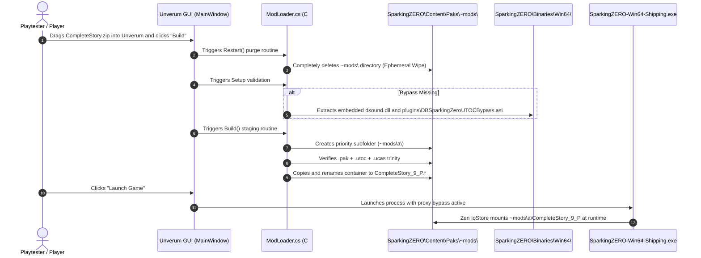

# Case Study: Unverum Mod Manager

> **Subject:** [`TekkaGB/Unverum`](https://github.com/TekkaGB/Unverum) (Audited @ commit `e41b135`)  
> **Domain:** Mod Distribution Architecture, Priority Staging, and Non-Destructive Packaging  
> **Target Game:** *Dragon Ball: Sparking! ZERO* (Steam AppID `1790600`, Unreal Engine 5.1.1)  
> **Significance:** Authoritative distribution and deployment blueprint for Complete Story (`dist/CompleteStory-v0.3-Unverum.zip`), automated `_9_P` renaming, and staging directory lifecycle.

---

## 1. Executive Summary & Problem Context

In game modding, authoring a functional mod is only half the battle. Delivering that mod to non-technical end users introduces severe operational challenges:
1. **Container Friction:** End users struggle to manually place `.pak`, `.utoc`, and `.ucas` container triplets into deep Steam directories (`SparkingZERO\Content\Paks\~mods`).
2. **Mount Order Conflicts:** When multiple community mods modify overlapping assets, users have no easy mechanism to establish priority without manually prefixing filenames.
3. **Dirty Workspace Risks:** Manual file extraction into game folders frequently leaves orphaned files and corrupts vanilla installations.

Unverum resolves these distribution bottlenecks through an automated staging pipeline. By reverse-engineering Unverum's C# source code (`ModLoader.cs`, `Setup.cs`), Complete Story established its packaging standards ([ADR 0002](../../ADRs/0002-dependency-boundaries-and-unverum-delegation.md)) and build automation architecture.

---

## 2. Directory Anatomy & Staging Layout

Unverum maintains a strict separation between its distribution archives and the live game directories it manages:

```text
SparkingZERO/                              <-- Game Installation Root (Steam AppID 1790600)
├── Binaries/Win64/                        <-- Engine Executable & Proxy Injections
│   ├── SparkingZERO-Win64-Shipping.exe    <-- Engine Process
│   ├── dsound.dll                         <-- Proxy DLL (Injected by Unverum Setup)
│   ├── plugins/
│   │   └── DBSparkingZeroUTOCBypass.asi   <-- Signature Bypass (Injected by Unverum Setup)
│   └── Mods/                              <-- UE4SS Native Mod Directory
│       └── CompleteStory/                 <-- Staged Lua mod (main.lua, enabled.txt)
│
├── Content/Paks/
│   └── ~mods/                             <-- Ephemeral Mod Staging Directory (Wiped on Rebuild!)
│       ├── a/                             <-- Priority Folder 1 (Highest load priority)
│       │   ├── CompleteStory_9_P.pak      <-- Auto-renamed with _9_P suffix
│       │   ├── CompleteStory_9_P.utoc     <-- Matching TOC table
│       │   └── CompleteStory_9_P.ucas     <-- Matching CAS container chunks
│       └── b/                             <-- Priority Folder 2 (Lower load priority)
│           └── SecondaryMod_9_P.pak
│
└── SparkingZERO/
    └── Mods/                              <-- SZModLib Directory (.uplugin packages)
```

---

## 3. Architectural Scaffolding & Design Patterns

By analyzing Unverum's source code at commit `e41b135`, Complete Story identified four critical system patterns:

### A. The Strict Zen IoStore "Trinity" Rule (`ModLoader.cs` L110–L115)
* `[FACT]` Unverum iterates through `.pak` files first. It inspects whether matching `.utoc` and `.ucas` files exist with the exact same base name:
  ```csharp
  if (File.Exists(utoc) && File.Exists(ucas)) {
      File.Copy(pak, Path.Combine(dest, newName + ".pak"));
      File.Copy(utoc, Path.Combine(dest, newName + ".utoc"));
      File.Copy(ucas, Path.Combine(dest, newName + ".ucas"));
  }
  ```
* `[OBSERVATION]` If a mod developer supplies only a naked `.utoc` and `.ucas` without an accompanying `.pak`, Unverum completely ignores the container and installs nothing.
* `[POLICY]` Complete Story's `retoc to-zen` build phase generates the required companion `.pak`, ensuring 100% compatibility with Unverum's loader.

### B. Automated `_9_P` Priority Staging (`ModLoader.cs` L90, L275–L308)
* `[FACT]` Unverum creates alphabetic subdirectories under `~mods` (`a`, `b`, ... `z`, then `~a` ...) reflecting the user's GUI load order.
* `[FACT]` When copying the `.pak`, Unverum automatically appends `_9_P` to the filename:
  ```csharp
  string newName = Path.GetFileNameWithoutExtension(pak) + "_9_P";
  ```
* `[POLICY]` Mod developers must **never** manually name release files `CompleteStory_9_P.pak`. If pre-named with `_P`, Unverum appends another suffix resulting in `CompleteStory_P_9_P.pak`. Name archives with clean base identifiers (`CompleteStory.pak`).

### C. The Ephemeral Build Wipe Lifecycle (`ModLoader.cs` L18–L74)
* `[FACT]` When the user clicks "Build" in Unverum (`MainWindow.xaml.cs` L826), the application executes `Restart` before staging new files.
* `[FACT]` `Restart` completely purges and deletes the entire `SparkingZERO\Content\Paks\~mods` folder, along with `SparkingZERO\Mods` and `Binaries\Win64\Mods`.
* `[WARNING]` The `~mods` directory is an ephemeral staging cache, not persistent storage. Developers who edit or keep source files directly in `~mods` lose all uncommitted work when Unverum builds. Complete Story keeps all source files safely isolated in repository roots (`assets/`, `CompleteStory/`).

### D. Automated Anti-Cheat / Bypass Injection (`Setup.cs` L60–L97)
* `[FACT]` Unverum embeds `dsound.dll` and `DBSparkingZeroUTOCBypass.asi` directly within its own application resources (`Unverum.csproj` L53–L54).
* `[FACT]` During setup, if `plugins\DBSparkingZeroUTOCBypass.asi` is missing from `Binaries\Win64`, Unverum automatically extracts and writes the bypass.
* `[POLICY]` Mod release archives must never bundle or redistribute `dsound.dll` or `DBSparkingZeroUTOCBypass.asi` ([ADR 0002](../../ADRs/0002-dependency-boundaries-and-unverum-delegation.md)). Distribute pure mod assets and let Unverum manage environmental bypasses.

---

## 4. End-to-End Staging Lifecycle Trace



---

## 5. Transferable Rules for Future Mod Projects

When building or packaging any Unreal Engine mod intended for community distribution:

1. **The Zen Trinity Rule:** Always generate and package the `.pak` sibling alongside `.utoc` and `.ucas` containers. Never distribute orphan `.utoc`/`.ucas` files.
2. **Clean Base Naming:** Do not pre-append `_9_P` to packaged files; allow the mod manager to handle mount priority suffixes dynamically.
3. **Never Treat `~mods` as Storage:** Treat `~mods` as a volatile cache that can be destroyed without warning. Keep all project assets under Git source control.
4. **Zero Bypass Bundling:** Delegate environment setup (proxy DLLs, signature bypasses) to the mod manager or documentation; never redistribute binary bypass tools in mod zips ([ADR 0002](../../ADRs/0002-dependency-boundaries-and-unverum-delegation.md)).
