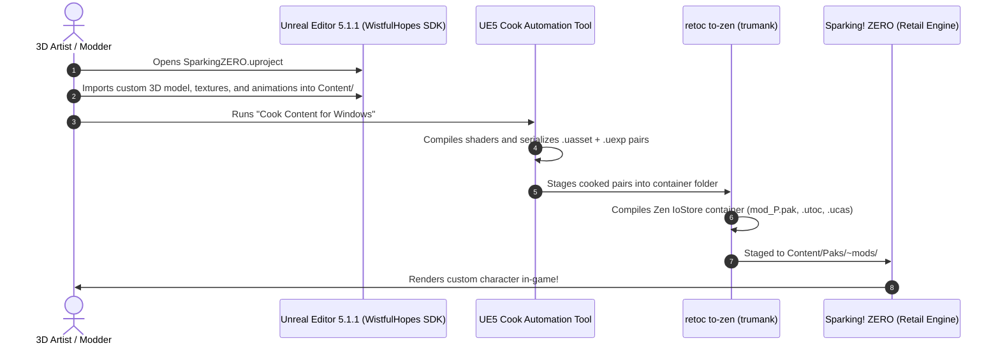

# Case Study: WistfulHopes (`SparkingZero_ModProject`)

> **Subject:** [`WistfulHopes/SparkingZero_ModProject`](https://github.com/WistfulHopes/SparkingZero_ModProject) (Audited @ `master`)  
> **Domain:** Unreal Engine 5 SDK Project Architecture & Editor Cooking Pipeline  
> **Target Game:** *Dragon Ball: Sparking! ZERO* (Unreal Engine 5.1.1, Steam PC)  
> **Significance:** Authoritative blueprint for authoring custom 3D character models, animations, materials, and Blueprints using the official Unreal Editor.

---

## 1. Executive Summary & Problem Context

While runtime memory mods (like AccessForge) hook live C++ code via Lua, 3D character, costume, moveset, and stage mods require creating or editing complex Unreal Engine binary assets (`.uasset` and `.uexp`). 

Modders face major architectural challenges when authoring new engine assets:
1. **Unreal Editor Asset Schema:** You cannot simply invent custom `.uasset` files in a hex editor; Unreal Engine requires valid binary headers, serialization tables, and class linkages created by the engine itself.
2. **Missing C++ Class Signatures:** When launching Unreal Editor without the game's native classes, opening any game Blueprint or animation causes editor crashes due to missing struct and enum definitions.
3. **Proprietary Plugin Dependencies:** Retail games use proprietary engine plugins (such as custom animation compression codecs) that must match the editor environment during asset cooking.

WistfulHopes solved this by reverse-engineering the game's reflection headers and distributing a reconstructed **Unreal Engine 5.1 SDK Project (`.uproject`)**.

---

## 2. Full Repository Directory Anatomy

Audited directly from [`WistfulHopes/SparkingZero_ModProject`](https://github.com/WistfulHopes/SparkingZero_ModProject) on GitHub:

```text
SparkingZero_ModProject/
├── SparkingZERO.uproject          <-- Unreal Engine 5.1.1 project descriptor
├── README.md                      <-- Setup guide ("You will need Unreal Engine 5.1")
├── .gitignore                     <-- Filters Intermediate/, Saved/, DerivedDataCache/
├── Config/                        <-- Engine and editor configuration files
│   ├── DefaultEditor.ini          <-- Editor startup settings
│   ├── DefaultEngine.ini          <-- Zen IoStore mount paths, asset classes, render settings
│   ├── DefaultGame.ini            <-- Game framework configuration
│   ├── DefaultGameplayTags.ini    <-- Game-specific gameplay tags
│   ├── DefaultInput.ini           <-- Controller & keyboard action mappings
│   ├── DefaultScalability.ini     <-- Graphics presets
│   └── Windows/                   <-- Platform-specific overrides
│       ├── WindowsEngine.ini
│       └── WindowsGame.ini
├── Binaries/                      <-- Pre-compiled editor binaries & modules
│   └── Win64/
│       ├── SparkingZEROEditor.target
│       ├── UnrealEditor-SS.dll     <-- Core game editor module
│       ├── UnrealEditor-SSKeyInput.dll
│       └── UnrealEditor.modules
├── Content/                       <-- Reconstructed vanilla asset stubs & content tree
│   └── SS/
│       └── Core/
│           └── BP_KoratGameSingleton.uasset <-- Core singleton Blueprint stub
├── Plugins/                       <-- Engine plugins matching retail game build
│   └── EnginePlugins/Marketplace/ACLPlugin/
│       ├── ACLPlugin.uplugin      <-- Animation Compression Library (ACL) descriptor
│       ├── Binaries/Win64/        <-- Pre-compiled ACL editor DLLs
│       ├── Content/               <-- Compression settings assets
│       └── Source/                <-- Full C++ source for ACL plugin & editor module
└── Source/                        <-- Reconstructed C++ game source modules
```

---

## 3. Architectural Scaffolding & Design Patterns

WistfulHopes' SDK architecture establishes four critical principles for asset modding:

### A. The Reconstructed SDK Project Pattern (`.uproject`)
* `[FACT]` Modders clone this repository and open `SparkingZERO.uproject` using **Unreal Engine 5.1.1**.
* `[OBSERVATION]` By providing stub classes and editor DLLs (`UnrealEditor-SS.dll`), Unreal Editor loads without errors, allowing modders to use native viewport tools, animation sequence editors, and material graph editors.

### B. Plugin & Codec Parity (`ACLPlugin`)
* `[FACT]` *Dragon Ball: Sparking! ZERO* compresses all character skeletons and battle animations using the third-party **Animation Compression Library (ACL)**.
* `[FACT]` Without the matching ACL plugin in `Plugins/EnginePlugins/Marketplace/ACLPlugin/`, Unreal Editor cannot decompress retail animations or cook custom animations compatible with the retail game.
* `[POLICY]` When authoring engine assets, mod projects must maintain 100% parity with the retail game's engine plugins.

### C. The Native Engine Cook Pipeline
* `[FACT]` Instead of manually crafting binary files, modders import FBX meshes, textures, and audio into `Content/`, then run Unreal Editor's standard cook command:
  ```powershell
  UnrealEditor.exe "SparkingZERO.uproject" -run=Cook -TargetPlatform=Windows
  ```
* `[OBSERVATION]` The editor's cook process generates authoritative, perfectly linked `.uasset` + `.uexp` export pairs under `Saved/Cooked/Windows/SparkingZERO/Content/`.

### D. Downstream IoStore Packaging via `retoc`
* `[FACT]` The cooked output from Unreal Editor is in legacy uncompressed format.
* `[POLICY]` The cooked `.uasset` and `.uexp` files are fed into `retoc to-zen` to generate the final IoStore container triplet (`.pak`, `.utoc`, `.ucas`) mounted in-game via `~mods/`.

---

## 4. End-to-End Asset Authoring Lifecycle Trace



---

## 5. Transferable Rules for Future Mod Projects

When authoring custom assets for Unreal Engine games:

1. **Strict Engine Version Matching:** Always match the exact Unreal Engine minor version (Sparking! ZERO uses UE `5.1.1`). Assets cooked on newer engine versions (e.g. UE 5.3 or 5.4) fail to load in retail binaries.
2. **Plugin Codec Parity:** Ensure proprietary plugins (like ACL) are installed in the editor before importing or cooking animation data.
3. **Never Edit Raw Binaries Directly:** Use an SDK project in Unreal Editor for complex 3D meshes and materials, reserving headless JSON patching (like `UAssetGUI`) for surgical data table changes.
4. **Separate Authoring SDK from Distribution:** The SDK repository (gigabytes of editor cache and sources) must remain distinct from the lightweight distribution container shipped to players.
