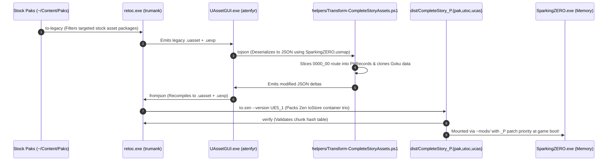

# Case Study: WistfulHopes (`SparkingZERO_ModProject`)

> **Subject:** WistfulHopes (Aeryn Mu / Ryn) — Fighting Game Modding & UE5 Tooling Patterns  
> **Domain:** Unreal Engine 5 Zen/IoStore Packaging & Non-Destructive Priority Overlays  
> **Target Game:** *Dragon Ball: Sparking! ZERO* (Unreal Engine 5.1.1, Steam PC)  
> **Significance:** Primary architectural blueprint for Complete Story's asset compilation pipeline, `_P` patch mounting, and distribution boundaries.

---

## 1. Executive Summary & Problem Context

WistfulHopes is a prominent fighting game reverse-engineer, modder, and technical artist recognized across the anime fighting game scene (*Dragon Ball FighterZ*, *Guilty Gear -Strive-*, *Dragon Ball: Sparking! ZERO*), as well as the creator of the Unreal Engine 5 fighting game framework *Night Sky Engine*.

When *Dragon Ball: Sparking! ZERO* launched with Unreal Engine 5.1.1's modern **IoStore (Zen)** architecture, traditional modding workflows collapsed:
1. **Legacy Tools Obsolete:** `UnrealPak.exe` and legacy `.pak` injectors produced packages that Sparking! ZERO completely rejected.
2. **Encrypted Container Bloat:** Assets were locked inside massive multi-gigabyte `.utoc` and `.ucas` chunk containers guarded by AES encryption and RSA signature checks.
3. **Data Integrity Hazards:** Naive asset modifications corrupted engine package linkers or permanently overwrote user save files.

WistfulHopes' workflow established how to unpack, modify, recompile, and non-destructively mount custom UE 5.1.1 assets using **`retoc`** and **IoStore patch priority**.

---

## 2. Full Repository Directory Anatomy

A professional Unreal Engine 5 IoStore mod project enforces strict isolation between raw source assets, ephemeral conversion staging, external CLI compilers, and distribution artifacts:

```text
WistfulHopes-ModProject/
├── Content/                       <-- Cooked Source Assets (Matching game mount paths)
│   └── SS/
│       ├── Blueprints/            <-- Game data table assets (e.g. DragonAdventureIFData.uasset)
│       └── MasterDataAsset/       <-- Character definition assets (e.g. DAIF_CharaData_*.uasset)
│
├── staging/                       <-- Ephemeral Intermediate Tree (Excluded from Git)
│   ├── legacy/                    <-- Extracted unversioned .uasset + .uexp pairs
│   ├── json/                      <-- Deserialized human/agent-readable JSON
│   ├── modified-json/             <-- Mutated JSON with custom characters/routes spliced
│   └── container/                 <-- Recompiled binary .uasset + .uexp + scriptobjects.bin
│
├── tools/                         <-- Pinned External Compiler Binaries (Audited dependencies)
│   ├── retoc/                     <-- IoStore container compiler (trumank/retoc v0.1.5)
│   │   └── retoc.exe
│   └── uassetgui/                 <-- Headless JSON serializer (atenfyr/UAssetGUI v1.1.0)
│       ├── UAssetGUI.exe
│       └── Data/Mappings/
│           └── SparkingZERO.usmap  <-- Unversioned property mapping file
│
├── helpers/                       <-- Automation Pipeline (Windows PowerShell cmdlets)
│   ├── Common.ps1                 <-- Shared environment resolvers and path validators
│   ├── Build-Mod.ps1              <-- Master orchestrator executing Stages 1 -> 6
│   └── Transform-Assets.ps1       <-- Pure in-memory domain JSON mutation script
│
└── dist/                          <-- Authoritative Distribution Artifacts
    ├── CompleteStory_P.pak        <-- Lightweight container index header
    ├── CompleteStory_P.utoc       <-- Table of Contents (chunk hashes & directory index)
    ├── CompleteStory_P.ucas       <-- Compressed asset payload container
    └── CompleteStory-v0.3.zip     <-- Clean Unverum release archive (container trio only)
```

---

## 3. Architectural Scaffolding & Design Patterns

WistfulHopes' workflow establishes four critical modding architectural patterns:

### A. The Immutable Overlay Filesystem (The "Docker Layers" Pattern)
* `[FACT]` Unreal Engine 5's IoStore file system does not replace files on disk. Instead, it mounts containers into a unified virtual filesystem root (`/Game/...`).
* `[FACT]` If a container filename includes the `_P` ("Patch") suffix (e.g., `CompleteStory_P.utoc`), Unreal Engine's Zen container loader grants it higher lookup priority in memory.
* `[OBSERVATION]` Any asset path present in `CompleteStory_P` (such as `/Game/SS/Blueprints/DragonAdventureIFData`) intercepts and overrides the vanilla asset in memory, while the multi-gigabyte stock containers on disk remain 100% untouched.
* `[POLICY]` This guarantees the Non-Destructive Coexistence Invariant (`AGENTS.md` §4.3): If the mod is uninstalled or disabled, the game immediately falls back to stock vanilla behavior with zero file restoration needed.

### B. The Split Binary Coupling Invariant (`.uasset` + `.uexp`)
* `[FACT]` Cooked Unreal Engine 5 packages split each asset into two files:
  1. `<PackageName>.uasset`: Header metadata, import tables, export definitions, and name maps.
  2. `<PackageName>.uexp`: Serialized binary export data (properties, meshes, audio payloads).
* `[FACT]` `retoc to-zen` requires both files. If a `.uasset` exists in `staging/container/` without a matching `.uexp`, `retoc` silently skips the package without failing the build, resulting in missing in-game content.
* `[POLICY]` Complete Story enforces automated post-compilation assertions: every `.uasset` must have its matching `.uexp`, and all three container files (`.pak`, `.utoc`, `.ucas`) must have non-zero file sizes before packaging.

### C. The Reflection Metadata Gate (`scriptobjects.bin`)
* `[FACT]` When converting modern Zen containers to legacy format (`retoc to-legacy`), retoc extracts `scriptobjects.bin`.
* `[OBSERVATION]` `scriptobjects.bin` contains global class/struct reflection definitions used by Unreal's Verse/VNI system and import checker.
* `[POLICY]` In Complete Story, `helpers/Build-CompleteStory.ps1` explicitly preserves and copies `scriptobjects.bin` from `staging/legacy/` into `staging/container/` before invoking `retoc to-zen`, ensuring clean package validation during level load.

### D. Clean Distribution Boundaries (ADR 0002)
* `[FACT]` A mod release archive should strictly contain data assets (`CompleteStory_P.pak`, `.utoc`, `.ucas`) at the zip root.
* `[OBSERVATION]` Naive mod releases often bundle anti-cheat bypass DLLs (`dsound.dll`), causing version collisions or security flags.
* `[POLICY]` Codified as [ADR 0002](../../ADRs/0002-dependency-boundaries-and-unverum-distribution.md): Complete Story never bundles third-party bypass binaries in release packages. Signature bypass installation and load ordering are delegated 100% to **Unverum**.

---

## 4. End-to-End Pipeline Lifecycle Trace



---

## 5. Transferable Rules for Future Mod Projects

When building any Unreal Engine 5 asset mod, obey these container laws:

1. **The Patch Suffix Law (`_P`):** Always append `_P` to your container output (`<ModName>_P.utoc`) so Unreal Engine's IoStore mounts your changes over vanilla assets in memory without touching disk files.
2. **The Container Trio Rule:** An IoStore mod package is never just a `.pak`. It is always three inseparable files (`.pak`, `.utoc`, `.ucas`). Never distribute or stage one without the other two.
3. **Split Export Verification:** Always verify that every `.uasset` has a matching `.uexp` in your container staging folder before running `retoc to-zen`.
4. **Zero Bypass Bundling:** Distribute strictly game data containers in release archives. Never bundle `dsound.dll` or proxy binaries with your mod data.
