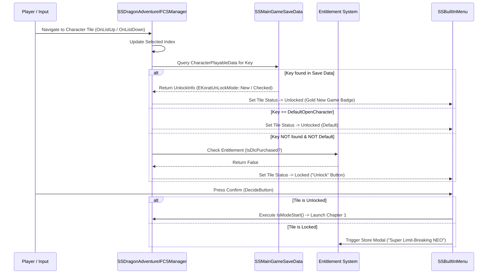

# Episode Battle Subsystem: C++ Engine Architecture & Lifecycle

> **Status:** AUDITED RESEARCH RECORD  
> **Target Class:** `/Script/SS.SSDragonAdventureIFCSManager`  
> **Source Receipts:**  
> - `evidence/object-dump/targeted-symbols.txt` (commit `e719f6b0`, lines 5659–102945)  
> - `crates/complete-story-runtime/tests/pattern_tests.rs` (8 passing disassembly tests)  
> - `SparkingZERO-Win64-Shipping.exe` live PE image analysis  

---

## 1. Class Hierarchy & Architecture

The Episode Battle character selection carousel is managed by an actor component class residing in the native `SS` module:

```text
/Script/CoreUObject.Object
  └── /Script/Engine.ActorComponent
        └── /Script/SS.SSDragonAdventureIFCSManager
```

* `[FACT]`: The module name is **`SS`**, not `SparkingZERO`. Any reflection or UFunction query targeting `/Script/SparkingZERO` fails silently with nullptr.
* `[FACT]`: The manager owns a pointer to `BuiltInMenu` (`/Script/SS.SSBuiltInMenu`), which wraps the lower-level Slate/UMG widget carousel and dispatches entry selection events.

---

## 2. Reflected Member Functions & Properties

The following functions and properties are formally exported to Unreal Engine's reflection system (`GUObjectArray`):

| Line in Object Dump | Member / Function Symbol | Type | Description |
|---|---|---|---|
| 17516 | `BuiltInMenu` | `ObjectProperty` | Pointer to `/Script/SS.SSBuiltInMenu` handling carousel UI. |
| 102939 | `IsModeStart` | `Function` | Evaluates whether the currently selected saga can enter mode start. |
| 102941 | `IsPlayable` | `Function` | Evaluates whether the currently selected saga is unlocked. |
| 102942 | `IsPlayable:ReturnValue` | `BoolProperty` | The single boolean return value of `IsPlayable` (no input parameters). |
| 102944 | `OnListDown` | `Function` | Invoked when the user navigates carousel backward. |
| 102945 | `OnListUp` | `Function` | Invoked when the user navigates carousel forward. |
| 100423 | `SSBuiltInMenu:DecideButton` | `Function` | Invoked when the player presses Enter/A to select the highlighted tile. |
| 100425 | `SSBuiltInMenu:NewDecideButton`| `Function` | Invoked when the highlighted tile is in "New Game" state. |

---

## 3. Native Execution Thunk Architecture (`UFunction::Func`)

In Unreal Engine 5, native C++ functions exposed to Blueprints have a two-tier calling mechanism:

```
[Blueprint VM / Script Call] ──> [UFunction::Func Pointer (0xD8)] ──> [Native C++ Machine Code]
                                                                                │
                                                                   (Bypasses ProcessInternal)
```

### 3.1 Empirical Machine Code Signatures
Our automated disassembly tests in `crates/complete-story-runtime/tests/pattern_tests.rs` verified the exact machine code locations in `SparkingZERO-Win64-Shipping.exe`:

* `execIsPlayable`:
  - **RVA:** `0x1EC35B0` (File offset `0x1EC2BB0`)
  - **Prologue:** `40 53 48 83 EC 20` (`push rbx; sub rsp, 20h`)
  - **Calling Convention:** `void (*)(UObject* Context, FFrame* Stack, void* RESULT_DECL)`
  - **Behavior:** Reads character key, evaluates condition, and stores result byte directly into `[rbx]` (`mov [rbx], al`, where `rbx` points to `RESULT_DECL`).
* `execIsModeStart`:
  - **RVA:** `0x1EC3580` (File offset `0x1EC2B80`)
  - **Prologue:** `40 53 48 83 EC 20` (`push rbx; sub rsp, 20h`)
* `SSDragonAdventureIFCSManager::IsPlayable` (Implementation Body):
  - **RVA:** `0x24F1430` (File offset `0x24F0A30`)

### 3.2 Why Blueprint Dispatchers Bypassed This Function
* `[FACT]`: In Unreal Engine, `ProcessEvent` is invoked by C++ code calling Blueprint graphs.
* `[FACT]`: `ProcessInternal` is invoked by the Blueprint bytecode virtual machine.
* `[FACT]`: Because `IsPlayable` is a compiled native C++ function, the engine calls `Function->Func` directly. This explains why detouring `ProcessInternal` or `ProcessEvent` never intercepted `IsPlayable` in our earlier iterations.

---

## 4. Lifecycle Execution Sequence



---

## 5. Epistemic Assessment

* `[FACT]`: The manager class `SSDragonAdventureIFCSManager` is the single authoritative coordinator for carousel state and playability checks.
* `[FACT]`: Native hooks on `execIsPlayable` (RVA `0x1EC35B0`) directly intercept the execution thunk that writes the boolean return value to `RESULT_DECL`.
* `[OBSERVATION]`: However, UI state is determined by whether the tile is rendered in `EKoratUnLockMode::New` mode vs `EKoratUnLockMode::Lock`. The button dispatch switches between `DecideButton` and `NewDecideButton` depending on this state.
