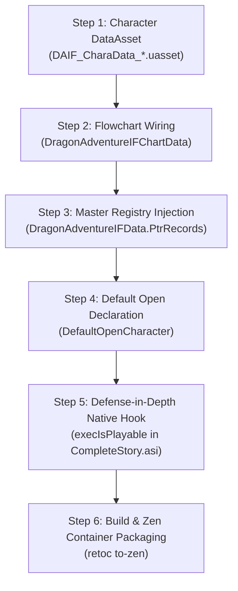

# Episode Battle Subsystem: Custom Saga Integration Runbook

> **Status:** SYNTHESIZED INTEGRATION SPECIFICATION  
> **Target Subsystem:** `DragonAdventureIF` End-to-End Implementation  
> **Source Documents:**  
> - [`01-asset-hierarchy-and-schemas.md`](01-asset-hierarchy-and-schemas.md)  
> - [`02-cpp-manager-and-lifecycle.md`](02-cpp-manager-and-lifecycle.md)  
> - [`03-save-data-interface.md`](03-save-data-interface.md)  
> - [`04-entitlements-and-dlc-system.md`](04-entitlements-and-dlc-system.md)  

---

## 1. Overview & Goal

This runbook is the authoritative, step-by-step engineering specification for registering, unlocking, and launching any custom Episode Battle campaign in *Dragon Ball: Sparking! ZERO*.

Every rule and step below cites its verified receipt from documents `01` through `04`. No step is based on unverified speculation.

---

## 2. Step-by-Step Integration Workflow

---

### Step 1: Author Character Story DataAsset (`DAIF_CharaData_*.uasset`)
* **Receipt:** `01-asset-hierarchy-and-schemas.md` §3
* **Action:**
  1. Author a dedicated character DataAsset under:
     `SparkingZERO/Content/SS/MasterDataAsset/DragonAdventureIF/<Key>/DAIF_CharaData_<Key>.uasset`
  2. Define localization string table keys in `ST_ADIF_CHR_NAME` (Character Name) and `ST_ADIF_SYNOPSIS` (Campaign Description).
  3. Wire starting mission pointers:
     - `Event_00_0_00_00`
     - `EventBlock_0000_00`
     - `DIF_Event_0000_00`
     - `ChartData0000_00`

---

### Step 2: Wire Mission Flowchart Graph (`DragonAdventureIFChartData.uasset`)
* **Receipt:** `01-asset-hierarchy-and-schemas.md` §1 & §4
* **Action:**
  1. Open `DragonAdventureIFChartData.uasset`.
  2. Register the character's chapter nodes, battle triggers, and win/loss branches.
  3. Ensure the initial battle node routes cleanly without referencing undefined DLC entitlement keys.

---

### Step 3: Register in Master Carousel (`DragonAdventureIFData.PtrRecords`)
* **Receipt:** `01-asset-hierarchy-and-schemas.md` §2.1
* **Action:**
  1. Append a new entry to the `PtrRecords` array in `DragonAdventureIFData.uasset`:
     - Element 0 (`Key`): `FKoratCharacterDataList` key (e.g. `"0000_00"`).
     - Element 1 (`DataAsset`): Negative import index pointing to `DAIF_CharaData_<Key>`.
  2. Update `NameMap`, `NamesReferencedFromExportDataCount`, and `Imports` table with the package and object imports.
  3. Add negative import index to `CreateBeforeCreateDependencies`.

---

### Step 4: Declare Native Unlock Status (`DefaultOpenCharacter`)
* **Receipt:** `01-asset-hierarchy-and-schemas.md` §2.2, `03-save-data-interface.md` §2.1, & `04-entitlements-and-dlc-system.md` §3
* **Action:**
  1. Set `DefaultOpenCharacter` in `DragonAdventureIFData.uasset` to the custom character key (e.g. `"0000_00"`).
  2. This triggers the engine's built-in default unlock check on fresh save files, allowing the tile to evaluate `IsPlayable == true` without requiring unsafe save file mutations.

---

### Step 5: Install Native ABI Fallback Detour (`CompleteStory.asi`)
* **Receipt:** `02-cpp-manager-and-lifecycle.md` §3 & §4
* **Action:**
  1. In `crates/complete-story-runtime`, attach MinHook detours to:
     - `execIsPlayable` (RVA `0x1EC35B0`)
     - `execIsModeStart` (RVA `0x1EC3580`)
  2. When executed, write `true` directly to `*RESULT_DECL` (`mov [rbx], al`).
  3. This ensures that even if save data flags are unpopulated, the engine unconditionally switches the UI state from `EKoratUnLockMode::Lock` (value 0) to `EKoratUnLockMode::New` (value 1).

---

### Step 6: Zen Container Packaging & Deployment
* **Receipt:** `01-asset-hierarchy-and-schemas.md` §1 & `AGENTS.md` §4.1
* **Action:**
  1. Pack modified assets into standard UE5 IoStore containers (`CompleteStory_P.pak`, `CompleteStory_P.utoc`, `CompleteStory_P.ucas`) via `retoc to-zen`.
  2. Deploy containers directly to `SparkingZERO/Content/Paks/~mods/`.
  3. Deploy `CompleteStory.asi` to `SparkingZERO/Binaries/Win64/plugins/`.

---

## 3. Verification & Acceptance Checklist

Before certifying a custom saga as complete, verify all four criteria:

- [ ] **Carousel Presence:** The character appears as a distinct 3D selection tile on the Episode Battle carousel ring.
- [ ] **Gold Badge Status:** The tile renders the gold **"New Game"** badge (`EKoratUnLockMode::New`), NOT the orange "Unlock" button (`EKoratUnLockMode::Lock`).
- [ ] **Storefront Bypass:** Confirming the tile launches into Chapter 1 (`IsModeStart`); it **never** triggers the Steam DLC store modal (*"Super Limit-Breaking NEO"*).
- [ ] **Save File Coexistence:** The player's existing save data (`MainGameSaveData.sav`) is never overwritten, modified, or corrupted.
