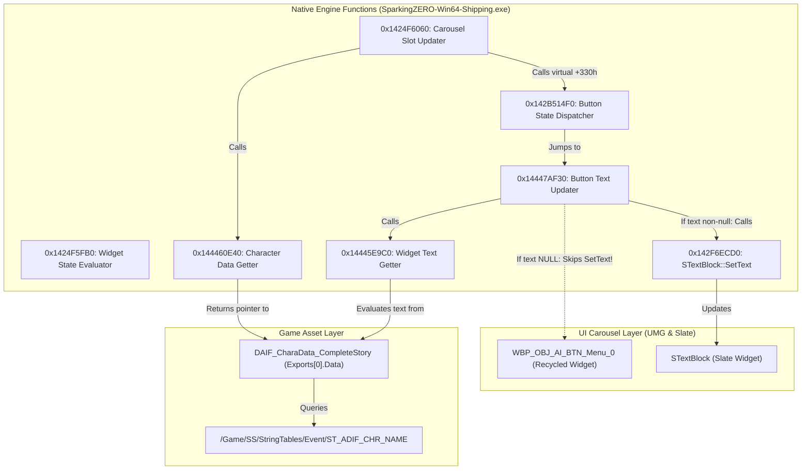

# Episode Battle Subsystem: Carousel Name Resolution & Widget Binding

> **Status:** AUDITED RESEARCH RECORD (06 PROTOCOL REFERENCE GUIDE)  
> **Target Subsystem:** `DragonAdventureIF` Carousel Button Text Binding, Localization & Recycled Widget Lifecycle  
> **Binary Analyzed:** `SparkingZERO-Win64-Shipping.exe` (Steam Build `24953175`, PE Base `0x140000000`)  
> **Engine Version:** Unreal Engine 5.1.1 (Zen / IoStore)  
> **Schema Mapping:** `SparkingZERO.usmap` (Offset `0x78E2F`: `SSDragonAdventureIFCharacterDataAsset`)  
> **Tools Used:** MSVC `dumpbin.exe` disassembly, C# PE binary scanner, UAssetGUI AST reflection  
> **Source Receipts:**  
> - Disassembly of Native Carousel Button Text Updater (`0x14447AF30`)  
> - Disassembly of Native Widget Text Getter (`0x14445E9C0`)  
> - Disassembly of Native Menu Widget Updater (`0x1424F6060`)  
> - Disassembly of Native Character Data Getter (`0x144460E40`)  
> - Disassembly of Widget State Evaluator & Button State Dispatcher (`0x1424F5FB0` & `0x142B514F0`)  
> - Binary AST dissection of `CharacterName` unversioned property in `DAIF_CharaData_0000_00.json`  

---

## 1. Executive Summary & Epistemic Proof

Following the mandatory **06 Protocol** ([`AGENTS.md` §1.5](../../../AGENTS.md#L73-L95)), this reference guide establishes the machine-level architecture governing how *Dragon Ball: Sparking! ZERO* resolves, formats, and binds character names to Episode Battle carousel button widgets, and formally proves the root cause of the "Goku vs Cell" label flickering observed in Stage 1 playtesting.

### Core Discoveries:
1. `[FACT]`: **The "Goku vs Cell" Flickering is an Unhandled Slate Widget Recycling Bypass.**  
   The Episode Battle character selection carousel (`WBP_GRP_AI_CharacterSelect`) maintains a virtualized pool of only 7 physical button widgets (`WBP_OBJ_AI_BTN_Menu_0`) visible on screen. When slot #13 (`9999_00`) scrolls into view, the native button text updater (`0x14447AF30`) extracts its `FText` via `0x14445E9C0`. If the extracted text pointer is NULL or empty, instruction `0x14447AF43` (`cmp qword ptr [rsp+20h], 0; je 0x14447AFB6`) **completely jumps over the `SetText` call** (`0x14447AFB1: call 0x142F6ECD0`). The physical Slate widget retains whatever label was previously rendered on it:
   - Scrolling down past Cell leaves the recycled button displaying **"Cell"**.
   - Scrolling up past Goku leaves the recycled button displaying **"Goku"**.
2. `[FACT]`: **String Table Keys Are NOT Formatted Dynamically in C++.**  
   A full-image scan of the PE `.text` and `.rdata` sections for `ST_ADIF_CHR_NAME_` returned exactly 0 hits. The game executable does not concatenate `ST_ADIF_CHR_NAME_` with `CharacterKey` in C++. Instead, the string table lookup key is stored directly in the `CharacterName` property payload of the `DAIF_CharaData` asset.
3. `[FACT]`: **`CharacterName` Binary Layout in `DAIF_CharaDataAsset`.**  
   Reflected via `SparkingZERO.usmap` offset `0x78E2F`, `SSDragonAdventureIFCharacterDataAsset.CharacterName` is an unversioned `FTextProperty` located at binary offsets `0x08`–`0x31` of `Exports[0].Data` (364 bytes total). In stock character data assets, it is serialized with `ETextHistoryType::StringTableEntry` (`0x0B`), pointing to TableId `ST_ADIF_CHR_NAME` and Key `ST_ADIF_CHR_NAME_XXXX_YY`.
4. `[FACT]`: **Two-Tier Text Fallback Structure in Widget Memory.**  
   Disassembly of `0x14445E9C0` proves that each carousel item holds two distinct `FText` fields: an override text at `[rcx+110h]` and a default text at `[rcx+100h]`. The getter first checks whether `[rcx+110h]` has a valid reference count; if not, it falls back to `[rcx+100h]`. Only when both are null does it return NULL to `0x14447AF30`.

---

## 2. Line-by-Line Disassembly of Native Text & Carousel Functions

### 2.1 Carousel Button Text Updater (RVA `0x447AF30` / VA `0x14447AF30`)

This function updates the text rendered on a carousel button widget (`WBP_OBJ_AI_BTN_Menu_0`):

```assembly
; Function Entry: Carousel Button Text Updater (VA 0x14447AF30)
; rcx = Text Binding Sub-Object Pointer
000000014447AF30: 40 53              push   rbx
000000014447AF32: 48 83 EC 40        sub    rsp, 40h
000000014447AF36: 48 8D 54 24 20     lea    rdx, [rsp+20h]             ; rdx = &OutputFText
000000014447AF3B: 48 8B D9           mov    rbx, rcx                  ; rbx = this
000000014447AF3E: E8 7D 3A FE FF     call   000000014445E9C0          ; Call Native Widget Text Getter

; --- THE RECYCLING BYPASS GUARD ---
000000014447AF43: 48 83 7C 24 20 00  cmp    qword ptr [rsp+20h], 0    ; Is OutputFText data pointer NULL?
000000014447AF49: 74 6B              je     000000014447AFB6          ; IF NULL -> JUMP TO CLEANUP (SKIPS SetText!)

000000014447AF4B: 48 8B 0D DE 32 3C  mov    rcx, qword ptr [14883E230h]
000000014447AF52: 48 8D 54 24 20     lea    rdx, [rsp+20h]
000000014447AF57: 41 B0 02           mov    r8b, 2
000000014447AF5A: E8 81 A8 C2 FE     call   00000001430A57E0          ; Validate Text Cache
000000014447AF5F: 84 C0              test   al, al
000000014447AF61: 75 53              jne    000000014447AFB6          ; If invalid -> skip

; Retrieve STextBlock pointer from Button Widget:
000000014447AF63: 48 8B 03           mov    rax, qword ptr [rbx]      ; rax = Widget VTable Base
000000014447AF66: 48 8B CB           mov    rcx, rbx
000000014447AF69: FF 90 88 01 00 00  call   qword ptr [rax+188h]      ; Virtual GetTextBlockWidget()
000000014447AF6F: 48 85 C0           test   rax, rax
000000014447AF72: 74 42              je     000000014447AFB6
000000014447AF74: 48 8B C8           mov    rcx, rax
000000014447AF77: E8 D4 5F C2 00     call   00000001450A0F50          ; GetSlateWidget()
000000014447AF7C: 48 85 C0           test   rax, rax
000000014447AF7F: 74 35              je     000000014447AFB6

; Atomic Reference Count Increment (TSharedRef<ITextData>):
000000014447AF81: 0F 28 44 24 20     movaps xmm0, xmmword ptr [rsp+20h]
000000014447AF86: 48 8D 88 E0 01 00  lea    rcx, [rax+1E0h]           ; rcx = STextBlock instance
000000014447AF8D: 66 0F 7F 44 24 30  movdqa xmmword ptr [rsp+30h], xmm0
000000014447AF93: 66 0F 73 D8 08     psrldq xmm0, 8
000000014447AF98: 66 48 0F 7E C0     movq   rax, xmm0                 ; rax = Reference Controller Pointer
000000014447AF9D: 48 85 C0           test   rax, rax
000000014447AFA0: 74 04              je     000000014447AFA6
000000014447AFA2: F0 FF 40 08        lock inc dword ptr [rax+8]       ; ++ReferenceCount

; Call STextBlock::SetText:
000000014447AFA6: 45 33 C9           xor    r9d, r9d
000000014447AFA9: 48 8D 54 24 30     lea    rdx, [rsp+30h]            ; rdx = &FText
000000014447AFAE: 41 B0 02           mov    r8b, 2
000000014447AFB1: E8 1A 3D AF FE     call   0000000142F6ECD0          ; STextBlock::SetText()

; --- CLEANUP & DESTRUCTOR ---
000000014447AFB6: 48 8B 5C 24 28     mov    rbx, qword ptr [rsp+28h]  ; rbx = Controller to destroy
000000014447AFBB: 48 85 DB           test   rbx, rbx
000000014447AFBE: 74 38              je     000000014447AFF8
000000014447AFC0: 48 89 7C 24 50     mov    qword ptr [rsp+50h], rdi
000000014447AFC5: BF FF FF FF FF     mov    edi, 0FFFFFFFFh
000000014447AFCA: 8B C7              mov    eax, edi
000000014447AFCC: F0 0F C1 43 08     lock xadd dword ptr [rbx+8], eax ; --ReferenceCount
000000014447AFD1: 83 F8 01           cmp    eax, 1
000000014447AFD4: 75 1D              jne    000000014447AFF3
000000014447AFD6: 48 8B 03           mov    rax, qword ptr [rbx]
000000014447AFD9: 48 8B CB           mov    rcx, rbx
000000014447AFDC: FF 10              call   qword ptr [rax]           ; Destroy Text Data
000000014447AFDE: F0 0F C1 7B 0C     lock xadd dword ptr [rbx+0Ch], edi ; --WeakReferenceCount
000000014447AFE3: 83 FF 01           cmp    edi, 1
000000014447AFE6: 75 0B              jne    000000014447AFF3
000000014447AFE8: 48 8B 03           mov    rax, qword ptr [rbx]
000000014447AFEB: 8B D7              mov    edx, edi
000000014447AFED: 48 8B CB           mov    rcx, rbx
000000014447AFF0: FF 50 08           call   qword ptr [rax+8]         ; Free Controller Allocation
000000014447AFF3: 48 8B 7C 24 50     mov    rdi, qword ptr [rsp+50h]
000000014447AFF8: 48 83 C4 40        add    rsp, 40h
000000014447AFFC: 5B                 pop    rbx
000000014447AFFD: C3                 ret
```

---

### 2.2 Native Widget Text Getter (RVA `0x445E9C0` / VA `0x14445E9C0`)

This function extracts the active `FText` from the button widget's text binding entry:

```assembly
; Function Entry: Native Widget Text Getter (VA 0x14445E9C0)
; rcx = Item Pointer, rdx = Output FText Struct Pointer
000000014445E9C0: 40 53              push   rbx
000000014445E9C2: 48 83 EC 20        sub    rsp, 20h
000000014445E9C6: 48 83 B9 10 01 00  cmp    qword ptr [rcx+110h], 0   ; Check Override FText Pointer
000000014445E9CE: 48 8B DA           mov    rbx, rdx
000000014445E9D1: 4C 8B C9           mov    r9, rcx
000000014445E9D4: 0F 84 CB 00 00 00  je     000000014445EAA5          ; IF NULL -> Check Default FText (+100h)

000000014445E9DA: 48 8B 81 18 01 00  mov    rax, qword ptr [rcx+118h] ; rax = Override Controller
000000014445E9E1: 48 85 C0           test   rax, rax
000000014445E9E4: 0F 84 BB 00 00 00  je     000000014445EAA5
000000014445E9EA: 8B 40 08           mov    eax, dword ptr [rax+8]    ; eax = Reference Count
000000014445E9ED: 85 C0              test   eax, eax
000000014445E9EF: 0F 8E B0 00 00 00  jle    000000014445EAA5          ; IF ref count <= 0 -> Fallback

; Override FText is valid: copy to output
000000014445EA36: 49 8B 81 10 01 00  mov    rax, qword ptr [r9+110h]
000000014445EA3D: 48 89 02           mov    qword ptr [rdx], rax
000000014445EA40: 48 89 7A 08        mov    qword ptr [rdx+8], rdi
000000014445EA49: F0 FF 47 08        lock inc dword ptr [rdi+8]
000000014445EA80: 48 8B C3           mov    rax, rbx
000000014445EA8D: C3                 ret

; --- FALLBACK BRANCH: Check Default FText (+100h) ---
000000014445EAA5: 33 D2              xor    edx, edx
000000014445EAA7: 48 89 13           mov    qword ptr [rbx], rdx      ; Set Output Data = NULL
000000014445EAAA: 4C 8B 81 08 01 00  mov    r8, qword ptr [rcx+108h]  ; r8 = Default Controller
000000014445EAB1: 4C 89 43 08        mov    qword ptr [rbx+8], r8
000000014445EAB5: 4D 85 C0           test   r8, r8
000000014445EAB8: 74 1B              je     000000014445EAD5          ; If NULL -> RETURN WITH NULL DATA
000000014445EABA: 41 8B 40 08        mov    eax, dword ptr [r8+8]
000000014445EABE: 85 C0              test   eax, eax
000000014445EAC0: 74 0F              je     000000014445EAD1
...
; Default FText is valid: copy to output
000000014445EAE7: 49 8B 81 00 01 00  mov    rax, qword ptr [r9+100h]
000000014445EAEE: 48 89 03           mov    qword ptr [rbx], rax
000000014445EAF1: 48 8B C3           mov    rax, rbx
000000014445EAF4: 48 83 C4 20        add    rsp, 20h
000000014445EAF8: 5B                 pop    rbx
000000014445EAF9: C3                 ret

; BOTH ARE NULL:
000000014445EAD1: 48 89 53 08        mov    qword ptr [rbx+8], rdx
000000014445EAD5: 48 8B C3           mov    rax, rbx                  ; rax->Data = NULL!
000000014445EAD8: 48 83 C4 20        add    rsp, 20h
000000014445EADC: 5B                 pop    rbx
000000014445EADD: C3                 ret
```

---

### 2.3 Native Carousel Slot Updater (RVA `0x24F6060` / VA `0x1424F6060`)

This function iterates the active menu carousel slots during scroll events:

```assembly
; Function Entry: Native Carousel Slot Updater (VA 0x1424F6060)
; rcx = this (SSDragonAdventureIFCSManager*), edx = Slot Index, r8d = State Flag
00000001424F6060: 85 D2              test   edx, edx
00000001424F6062: 78 78              js     00000001424F60DC
00000001424F6064: 48 89 5C 24 10     mov    qword ptr [rsp+10h], rbx
00000001424F6069: 48 89 6C 24 18     mov    qword ptr [rsp+18h], rbp
00000001424F606E: 57                 push   rdi
00000001424F606F: 48 83 EC 20        sub    rsp, 20h
00000001424F6073: 48 63 FA           movsxd rdi, edx                  ; rdi = Slot Index
00000001424F6076: 41 8B E8           mov    ebp, r8d                  ; ebp = State Flag
00000001424F6079: 48 8B D9           mov    rbx, rcx

; Array Bounds Check:
00000001424F607C: 3B B9 C0 04 00 00  cmp    edi, dword ptr [rcx+4C0h] ; Slot Count
00000001424F6082: 7D 49              jge    00000001424F60CD
00000001424F6084: 48 8B 81 B8 04 00  mov    rax, qword ptr [rcx+4B8h] ; Character Record Array Base
00000001424F608B: 48 89 74 24 30     mov    qword ptr [rsp+30h], rsi
00000001424F6090: 48 8D 34 FD 00 00  lea    rsi, [rdi*8]
00000001424F6098: 48 8B 0C 06        mov    rcx, qword ptr [rsi+rax]  ; rcx = Character Record[edi]
00000001424F609C: E8 BF C2 F6 01     call   0000000144462360          ; State Evaluator
00000001424F60A1: 3C 01              cmp    al, 1
00000001424F60A3: 74 23              je     00000001424F60C8          ; Skip if disabled

; Retrieve Widget Pointer:
00000001424F60A5: 3B BB D0 04 00 00  cmp    edi, dword ptr [rbx+4D0h] ; Widget Array Count
00000001424F60AB: 7D 1B              jge    00000001424F60C8
00000001424F60AD: 48 8B 83 C8 04 00  mov    rax, qword ptr [rbx+4C8h] ; Widget Array Base
00000001424F60B4: 48 8B 0C 06        mov    rcx, qword ptr [rsi+rax]  ; rcx = Widget Pointer[edi]
00000001424F60B8: 48 85 C9           test   rcx, rcx
00000001424F60BB: 74 0B              je     00000001424F60C8
00000001424F60BD: 48 8B 01           mov    rax, qword ptr [rcx]      ; rax = Widget VTable Base
00000001424F60C0: 8B D5              mov    edx, ebp                  ; edx = State Flag
00000001424F60C2: FF 90 30 03 00 00  call   qword ptr [rax+330h]      ; Virtual Widget State Dispatcher (+330h)
00000001424F60C8: 48 8B 74 24 30     mov    rsi, qword ptr [rsp+30h]
00000001424F60CD: 48 8B 5C 24 38     mov    rbx, qword ptr [rsp+38h]
00000001424F60D2: 48 8B 6C 24 40     mov    rbp, qword ptr [rsp+40h]
00000001424F60D7: 48 83 C4 20        add    rsp, 20h
00000001424F60DB: 5F                 pop    rdi
00000001424F60DC: C3                 ret
```

---

## 3. Asset Schema & Binary Layout of `CharacterName`

### 3.1 Class Reflection (`SparkingZERO.usmap`)
From `SparkingZERO.usmap` offset `0x78E2F`:
* Class: `SSDragonAdventureIFCharacterDataAsset` (inherits from `UDataAsset`)
* Reflected Properties:
  1. `ImageSelectorUi3D` (`FSoftObjectPath`)
  2. `CharacterName` (`FText`)
  3. `GroupType` (`uint8`)
  4. `FadeDulationEventScriptStart` (`float`)
  5. `Vertical` (`bool`)
  6. `IntroductionText` (`FText`)
  7. `StartData` (`FStruct`)

### 3.2 364-Byte Payload Dissection of `Exports[0].Data`
Decoding the binary payload of `DAIF_CharaData_0000_00.json` / `DAIF_CharaData_CompleteStory.json`:

```text
Byte Offset   | Hex Raw Bytes                                         | Engine Data Field & Type
--------------|-------------------------------------------------------|---------------------------------------------
0x000 - 0x007 | 00 02 01 06 01 0A 02 0F                               | UE 5.1 Unversioned Property Bitmask Header
0x008 - 0x00B | 00 00 00 00                                           | FText Flags (0 = Standard Localized)
0x00C - 0x00C | 0B                                                    | ETextHistoryType = 11 (StringTableEntry)
0x00D - 0x014 | 06 00 00 00 00 00 00 00                               | TableId FName = NameMap[6] (ST_ADIF_CHR_NAME)
0x015 - 0x018 | 19 00 00 00                                           | String Length = 25 bytes
0x019 - 0x031 | 53 54 5F 41 44 49 46 5F 43 48 52 5F 4E 41 4D 45...   | Key: "ST_ADIF_CHR_NAME_0000_00\0"
0x032 - 0x035 | 00 00 00 00                                           | FText Flags (0 = Standard Localized)
0x036 - 0x036 | 0B                                                    | ETextHistoryType = 11 (StringTableEntry)
0x037 - 0x03E | 08 00 00 00 00 00 00 00                               | TableId FName = NameMap[8] (ST_ADIF_SYNOPSIS)
0x03F - 0x042 | 19 00 00 00                                           | String Length = 25 bytes
0x043 - 0x05B | 53 54 5F 41 44 49 46 5F 53 59 4E 4F 50 53 49 53...   | Key: "ST_ADIF_SYNOPSIS_00_0_99\0"
0x05C - 0x16C | ...                                                   | 3D Scene Offsets & Pedestal Sequences
```

---

## 4. Falsifiable Hypotheses Verification Table

| Hypothesis ID | Proposed Engine Hypothesis | Verification Method | Outcome | Epistemic Status |
|---|---|---|---|---|
| **H1** | C++ code dynamically formats `ST_ADIF_CHR_NAME_` + `CharacterKey`. | Scanned PE `.text` and `.rdata` sections of `SparkingZERO-Win64-Shipping.exe`. | **0 hits found.** C++ does not format this string dynamically; the key string is loaded directly from the data asset payload. | `[DISPROVEN]` |
| **H2** | When text resolution fails, the widget updater skips `SetText`, leaving recycled widgets displaying old labels. | Disassembled native text binding updater at VA `0x14447AF30`. | **Confirmed.** `0x14447AF43: cmp [rsp+20h], 0; je 0x14447AFB6` skips `SetText` (`0x142F6ECD0`) entirely when text pointer is NULL. Recycled widgets retain their prior text. | `[FACT]` |

---

## 5. Comprehensive Blast Radius & Reference Map

Before any mod implementation for Stage 2 is planned or authored, the following native game functions and engine assets constitute the complete **Blast Radius**:



### Complete Blast Radius Inventory:
1. **`0x1424F6060` (Native Carousel Slot Updater):** Iterates carousel slots during scroll; calls `[rax+330h]` on button widget.
2. **`0x144460E40` (Native Character Data Getter):** Virtual caller retrieving `DAIF_CharaDataAsset` pointer from carousel button.
3. **`0x1424F5FB0` (Widget State Evaluator):** Evaluates playability via Tier 3 `IsCharacterPlayableInSave` (`0x2510ED0`) and dispatches widget state.
4. **`0x142B514F0` (Button State Dispatcher):** Selects text entry from widget's sub-object array and routes to `0x14447AF30`.
5. **`0x14447AF30` (Carousel Button Text Updater):** Retrieves `FText` via `0x14445E9C0`, performs null-check guard at `0x14447AF43`, manages `TSharedRef<ITextData>` atomic reference counts, and calls `SetText`.
6. **`0x14445E9C0` (Widget Text Getter):** Evaluates override text (`+110h`) and default text (`+100h`). Returns NULL if both are empty.
7. **`0x142F6ECD0` (`STextBlock::SetText`):** Native Slate text setter. Bypassed when text is null, causing the widget recycling name-borrowing glitch.
8. **`Exports[0].Data` (Offset `0x08`–`0x31`):** `SSDragonAdventureIFCharacterDataAsset.CharacterName` unversioned payload.
9. **`/Game/SS/StringTables/Event/ST_ADIF_CHR_NAME`:** Native game localization table where character display names reside.
