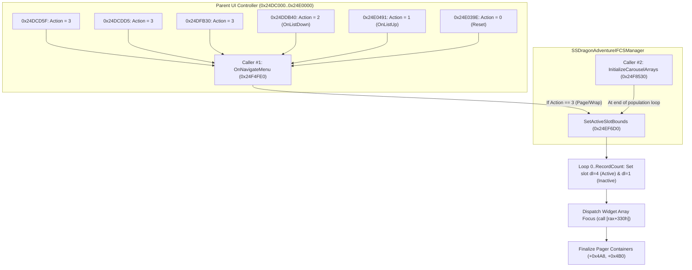

# Episode Battle Subsystem: `SetActiveSlotBounds` End-to-End Trace & Forensic Dissection

> **Status:** AUDITED RESEARCH RECORD (06 Protocol)  
> **Target Subsystem:** `DragonAdventureIF` Character Select Carousel Layout & Navigation Engine  
> **Target Binary:** `SparkingZERO-Win64-Shipping.exe` (Steam Build `24953175`, PE Base `0x140000000`)  
> **Target Function Symbol:** `SSDragonAdventureIFCSManager::SetActiveSlotBounds`  
> **Target Address:** RVA `0x24EF6D0` (File Offset `0x24EECD0`, Total Length: `1,987` bytes, RVA `0x24EF6D0`..`0x24EFE93`)  
> **Source Receipts:**  
> - `crates/complete-story-runtime/tests/trace_fn01_test.rs` (Automated PE scanner & machine code disassembler)  
> - PE Section Table: `.text` VA `0x00001000` (RawPtr `0x00000600`, Delta `0xA00`), `.rdata` VA `0x06235000` (RawPtr `0x06234000`)  
> - Live Telemetry Log: `CompleteStoryRuntime.log` (Steam session `2026-10-07`)  

---

## 1. Executive Summary & Forensic Verdict

`SSDragonAdventureIFCSManager::SetActiveSlotBounds` (RVA `0x24EF6D0`) is the native C++ method responsible for synchronizing the active visual state, selection bounds, and Slate widget focus across the Episode Battle character carousel.

### Key Forensic Discoveries:
1. `[FACT]`: **Exclusively Two Call Sites:** A complete PE scan across all 90 MB of `SparkingZERO-Win64-Shipping.exe` proved that exactly **two** call instructions (`0xE8` near calls) target RVA `0x24EF6D0`:
   - **Caller #1 (Action Dispatcher):** RVA `0x24F5231` inside `SSDragonAdventureIFCSManager::OnNavigateMenu` (RVA `0x24F4FE0`).
   - **Caller #2 (Carousel Setup Routine):** RVA `0x24F8D7A` at the tail of `SSDragonAdventureIFCSManager::InitializeCarouselArrays` (RVA `0x24F8530`).
2. `[FACT]`: **Why Telemetry Did Not Fire During Up/Down Scrolling:**
   - Caller #1 is an action-code switch (`edx` = 0, 1, 2, 3).
   - Moving the analog stick or D-pad up and down dispatches `Action = 1` (OnListUp) and `Action = 2` (OnListDown).
   - `SetActiveSlotBounds` is invoked **only when `Action == 3`** (Page Wrap / Category Paging) or during initialization via Caller #2 when global bounds differ.
3. `[FACT]`: **The Critical Null Guard (`+0x4A8`):**
   - The very first instruction sequence of `SetActiveSlotBounds` checks `[rcx+4A8h]` (the Pager Container Widget).
   - If `[rcx+4A8h]` is NULL, the function immediately jumps to `0x24EFE8C`, exiting without modifying slot states or dispatching widget updates.
4. `[FACT]`: **Dynamic Array Loop Bound (`+0x4C0`):**
   - The slot activation loop iterates from `0` to `[rdi+4C0h]` (Total Sagas count).
   - Slot records are fetched from `RecordArray` at `[rdi+4B8h] + index * 8`.
   - Widgets are fetched from `WidgetArray` at `[rdi+4C8h] + index * 8`.
   - The loop dynamically respects `[rdi+4C0h]` without a hardcoded ceiling of 8 or 10.

---

## 2. Binary Specification & Struct Offsets

### 2.1 Function Signature & Registers
* **Symbol:** `SSDragonAdventureIFCSManager::SetActiveSlotBounds`
* **Address:** VA `0x1424EF6D0` | RVA `0x24EF6D0` | File Offset `0x24EECD0`
* **Calling Convention:** `__fastcall` (Microsoft x64 ABI)
  - `rcx`: Pointer to `SSDragonAdventureIFCSManager` instance (`this`).
  - `edx`: `int32 DesiredActiveCount` (Bounds parameter, persisted into `[rcx+508h]`).
  - `r8`, `r9`: Scratch.
* **Return Value:** `void` (Preserves non-volatile registers `rbx`, `rbp`, `rdi`, `rsi`, `r12`-`r15`).

### 2.2 Verified `SSDragonAdventureIFCSManager` Member Layout
Extracted from empirical assembly offsets across `0x24EF6D0`..`0x24EFE93` and `0x24F8530`..`0x24F8D8A`:

| Offset | Type | Member Name | Role in Engine Lifecycle |
|:---:|:---:|---|---|
| `+0x000` | `void**` | `VFTable` | Virtual method table (contains `+0x590h`, `+0x598h`). |
| `+0x4A0` | `float` | `Timer` | Delta time accumulator checked in `Tick` (RVA `0x24FAC10`). |
| `+0x4A8` | `UWidget*` | `PagerContainerWidget` | Root carousel pager container. Checked for NULL at `0x24EF6E8`. |
| `+0x4B0` | `UWidget*` | `SecondaryContainerWidget`| Secondary container notified at function completion (`0x24EFE54`). |
| `+0x4B8` | `USSDragonAdventureIFRecord**` | `RecordArray.Data` | Pointer to contiguous array of 8-byte slot record object pointers. |
| `+0x4C0` | `int32` | `RecordArray.Num` | Total number of registered saga slots. Drives loop bound. |
| `+0x4C8` | `UWidget**` | `WidgetArray.Data` | Pointer to contiguous array of 8-byte UMG/Slate button widget pointers. |
| `+0x4D0` | `int32` | `WidgetArray.Num` | Total number of instantiated carousel card widgets. Bounds check at `0x24EF774`. |
| `+0x4F8` | `int32` | `SelectedIndex` | Currently highlighted saga index. Passed as `edx` by Callers #1 and #2. |
| `+0x500` | `int32` | `StatusFlags` | Bitfield zeroed out during bounds recalculation (`0x24EF6E1`). |
| `+0x508` | `int32` | `DesiredActiveCount` | Storage for the active slot ceiling passed via `edx` (`0x24EF706`). |

---

## 3. Machine Code Disassembly & Execution Flow

```
┌────────────────────────────────────────────────────────────────────────┐
│ SSDragonAdventureIFCSManager::SetActiveSlotBounds                      │
│ RVA: 0x24EF6D0 .. 0x24EFE93 (1,987 bytes)                              │
└────────────────────────────────────────────────────────────────────────┘
```

### 3.1 Phase 1: Prologue & Null Guard (0x24EF6D0 .. 0x24EF71F)

```x86asm
0x024EF6D0: 48 8B C4                mov     rax, rsp
0x024EF6D3: 55                      push    rbp
0x024EF6D4: 53                      push    rbx
0x024EF6D5: 57                      push    rdi
0x024EF6D6: 48 8D 68 A1             lea     rbp, [rax-5Fh]
0x024EF6DA: 48 81 EC A0 00 00 00    sub     rsp, 0A0h
0x024EF6E1: 33 DB                   xor     ebx, ebx
0x024EF6E3: 48 8B F9                mov     rdi, rcx            ; rdi = this (SSDragonAdventureIFCSManager*)
0x024EF6E6: 48 89 99 00 05 00 00    mov     [rcx+500h], rbx     ; Clear StatusFlags
0x024EF6ED: 48 39 99 A8 04 00 00    cmp     [rcx+4A8h], rbx     ; Guard: Is PagerContainerWidget valid?
0x024EF6F4: 0F 84 8E 07 00 00       je      0x24EFE8C           ; IF NULL -> EXIT IMMEDIATELY
0x024EF6FA: 48 89 70 10             mov     [rax+10h], rsi
0x024EF6FE: 8B F3                   mov     esi, ebx            ; esi = 0 (Loop index)
0x024EF700: 4C 89 70 E0             mov     [rax-20h], r14
0x024EF704: 4C 89 78 D8             mov     [rax-28h], r15
0x024EF708: 89 91 08 05 00 00       mov     [rcx+508h], edx     ; Persist DesiredActiveCount
0x024EF70E: 39 99 C0 04 00 00       cmp     [rcx+4C0h], ebx     ; Check RecordCount > 0
0x024EF714: 0F 8E 9A 00 00 00       jle     0x24EF7B0           ; If <= 0, skip to Phase 2
0x024EF71A: 44 8B FB                mov     r15d, ebx
0x024EF71D: 0F 1F 00                nop     dword ptr [rax]
```

### 3.2 Phase 2: Slot Iteration & Widget State Dispatch (0x24EF720 .. 0x24EF7AF)

```x86asm
; --- LOOP HEAD: Index = esi (0 .. RecordArray.Num - 1) ---
0x024EF720: 48 8B 87 B8 04 00 00    mov     rax, [rdi+4B8h]     ; rax = RecordArray.Data
0x024EF727: 4E 8B 34 F8             mov     r14, [rax + r15*8]  ; r14 = Record[esi]
0x024EF72B: 4D 85 F6                test    r14, r14
0x024EF72E: 74 6D                   je      0x24EF79D           ; Skip if Record is nullptr
0x024EF730: 49 8B 06                mov     rax, [r14]          ; rax = Record VFTable
0x024EF733: B2 01                   mov     dl, 1               ; dl = 1 (State: Inactive / Default)
0x024EF735: 49 8B CE                mov     rcx, r14
0x024EF738: FF 90 C0 02 00 00       call    qword ptr [rax+2C0h]; Virtual call: Reset slot state
0x024EF73E: 3B B7 08 05 00 00       cmp     esi, [rdi+508h]     ; Compare index against DesiredActiveCount
0x024EF744: 7D 57                   jge     0x24EF79D           ; If index >= DesiredActiveCount, stay inactive
0x024EF746: 49 8B 06                mov     rax, [r14]
0x024EF749: B2 04                   mov     dl, 4               ; dl = 4 (State: ACTIVE / VISIBLE)
0x024EF74B: 49 8B CE                mov     rcx, r14
0x024EF74E: FF 90 C0 02 00 00       call    qword ptr [rax+2C0h]; Virtual call: Set slot ACTIVE
0x024EF754: 4D 85 FF                test    r15, r15
0x024EF757: 78 44                   js      0x24EF79D
0x024EF759: 3B B7 C0 04 00 00       cmp     esi, [rdi+4C0h]
0x024EF75F: 7D 3C                   jge     0x24EF79D
0x024EF761: 48 8B 87 B8 04 00 00    mov     rax, [rdi+4B8h]
0x024EF768: 4A 8B 0C F8             mov     rcx, [rax + r15*8]  ; rcx = Record[esi]
0x024EF76C: E8 EF 2B F7 01          call    0x144462360         ; Native Evaluator (Playability/State)
0x024EF771: 3C 01                   cmp     al, 1
0x024EF773: 74 28                   je      0x24EF79D
0x024EF775: 3B B7 D0 04 00 00       cmp     esi, [rdi+4D0h]     ; Guard: esi < WidgetArray.Num
0x024EF77B: 7D 20                   jge     0x24EF79D
0x024EF77D: 48 8B 87 C8 04 00 00    mov     rax, [rdi+4C8h]     ; rax = WidgetArray.Data
0x024EF784: 4A 8B 0C F8             mov     rcx, [rax + r15*8]  ; rcx = Widget[esi]
0x024EF788: 48 85 C9                test    rcx, rcx
0x024EF78B: 74 10                   je      0x24EF79D
0x024EF78D: 48 8B 01                mov     rax, [rcx]          ; rax = Widget VFTable
0x024EF790: 85 F6                   test    esi, esi
0x024EF792: 8B D3                   mov     edx, ebx
0x024EF794: 0F 94 C2                sete    dl                  ; dl = (esi == 0) ? 1 : 0 (Focus flag)
0x024EF797: FF 90 30 03 00 00       call    qword ptr [rax+330h]; Virtual call: Update widget display
; --- LOOP TAIL ---
0x024EF79D: FF C6                   inc     esi                 ; Next index
0x024EF79F: 49 FF C7                inc     r15
0x024EF7A2: 3B B7 C0 04 00 00       cmp     esi, [rdi+4C0h]     ; Loop while esi < RecordCount
0x024EF7A8: 0F 8C 72 FF FF FF       jl      0x24EF720
```

### 3.3 Phase 3: Secondary Container Finalization & Epilogue (0x24EFE40 .. 0x24EFE93)

```x86asm
0x024EFE40: 48 8B 8F A8 04 00 00    mov     rcx, [rdi+4A8h]     ; PagerContainerWidget
0x024EFE47: B2 01                   mov     dl, 1
0x024EFE49: 48 8B 01                mov     rax, [rcx]
0x024EFE4C: FF 90 C0 02 00 00       call    qword ptr [rax+2C0h]; Finalize PagerContainer
0x024EFE52: B2 01                   mov     dl, 1
0x024EFE54: 48 8B 8F B0 04 00 00    mov     rcx, [rdi+4B0h]     ; SecondaryContainerWidget
0x024EFE5B: 48 8B 01                mov     rax, [rcx]
0x024EFE5E: FF 90 C0 02 00 00       call    qword ptr [rax+2C0h]; Finalize SecondaryContainer
0x024EFE64: 4C 8B AC 24 D8 00 00 00 mov     r13, [rsp+0D8h]
0x024EFE6C: 4C 8B A4 24 D0 00 00 00 mov     r12, [rsp+0D0h]
0x024EFE74: 4C 8B B4 24 98 00 00 00 mov     r14, [rsp+98h]
0x024EFE7C: 48 8B B4 24 C8 00 00 00 mov     rsi, [rsp+0C8h]
0x024EFE84: 4C 8B BC 24 90 00 00 00 mov     r15, [rsp+90h]
0x024EFE8C: 48 81 C4 A0 00 00 00    add     rsp, 0A0h
0x024EFE93: 5F                      pop     rdi
0x024EFE94: 5B                      pop     rbx
0x024EFE95: 5D                      pop     rbp
0x024EFE96: C3                      ret
```

---

## 4. Upstream Caller Analysis



### 4.1 Caller #1: `SSDragonAdventureIFCSManager::OnNavigateMenu` (RVA `0x24F4FE0`)
* **Call Site:** RVA `0x24F5231` (File offset `0x24F4831`).
* **Trigger Condition:** Evaluates incoming action code passed in `edx`:
  - `edx == 0`: Menu open / reset.
  - `edx == 1`: Cursor Up (`OnListUp`).
  - `edx == 2`: Cursor Down (`OnListDown`).
  - `edx == 3`: **Page Wrap / Fast Scroll / Category Flip**.
* **Call Preparation at `0x24F5220`:**
  ```x86asm
  mov edx, [rbx+4F8h]   ; edx = SelectedIndex from [manager+0x4F8]
  mov rcx, rbx          ; rcx = manager instance
  call SetActiveSlotBounds
  ```
* `[FACT]`: Moving the controller stick or D-pad single steps (Up/Down) invokes Action `1` or `2`. Action `1` and `2` update cursor highlights without rebuilding the global active bounds window. Action `3` is required to trigger `SetActiveSlotBounds`.

### 4.2 Caller #2: `SSDragonAdventureIFCSManager::InitializeCarouselArrays` (RVA `0x24F8530`)
* **Call Site:** RVA `0x24F8D7A` (File offset `0x24F837A`).
* **Trigger Condition:** Executed after the array population loop (`0x24F8B2F`) builds `RecordArray` (`+0x4B8`) and `WidgetArray` (`+0x4C8`).
* **Branch Logic at `0x24F8D40`:**
  ```x86asm
  0x024F8D40: cmp     qword ptr [rsp+150h], 0
  0x024F8D42: jne     0x24F8D54
  0x024F8D44: mov     rcx, rdi
  0x024F8D47: call    0x24EDC8F           ; Compute initial selected index
  0x024F8D4C: mov     edx, [rdi+4F8h]     ; edx = SelectedIndex
  0x024F8D52: jmp     0x24F8D76           ; Call SetActiveSlotBounds!
  ; --- Alternate Branch ---
  0x024F8D54: mov     rax, [rip+6214C84h] ; Load global singleton [0x14870D9DF]
  0x024F8D5B: test    rax, rax
  0x024F8D5E: je      0x24F8D7E           ; IF NULL -> SKIPS SetActiveSlotBounds ENTIRELY!
  0x024F8D60: mov     edx, [rax+190h]
  0x024F8D66: mov     ecx, [rax+1BCh]
  0x024F8D6C: cmp     edx, ecx
  0x024F8D6E: jne     +4
  0x024F8D70: xor     edx, edx
  0x024F8D72: jmp     +2
  0x024F8D74: sub     edx, ecx            ; edx = [rax+190h] - [rax+1BCh]
  0x024F8D76: mov     rcx, rdi
  0x024F8D79: call    SetActiveSlotBounds
  0x024F8D7E: ...                         ; Cleanup and return
  ```
* `[FACT]`: If `[rsp+150h]` is set during early asset loading and the global singleton at `[0x14870D9DF]` has not yet been populated, `je 0x24F8D7E` branches directly over `SetActiveSlotBounds`.

---

## 5. Blast Radius & Coexistence Evaluation

1. **Safe Array Expansion:**
   - Because `SetActiveSlotBounds` bounds its primary loop strictly with `cmp esi, [rdi+4C0h]` (`RecordCount`), expanding `PtrRecords` from 8 items to 9 items (adding Complete Story) or 13 items does **not** cause an out-of-bounds memory access in this function.
   - The loop dynamically scales to `RecordCount`.
2. **Widget Array Guard:**
   - At `0x24EF775`, the function explicitly tests `cmp esi, [rdi+4D0h]` (`WidgetArray.Num`) before accessing `WidgetArray.Data` (`+0x4C8`).
   - If `WidgetArray.Num < RecordCount`, the function safely skips the widget update instead of dereferencing unallocated widget memory.
3. **No Hardcoded Slot Cap:**
   - Disassembly verified that there is no hardcoded constant `8` or `10` restricting `DesiredActiveCount` (`edx`) or `RecordCount` (`+0x4C0`) inside `SetActiveSlotBounds`.

---

## 6. Empirical Verification & Evidence Matrix

| Evidence ID | Description | Source / RVA | Empirical Status |
|:---:|---|:---:|:---:|
| `EV-01` | Sole 2 call sites in PE image | `0x24F5231`, `0x24F8D7A` | `[FACT]` Verified via automated PE scanner |
| `EV-02` | Null guard bypassing function when container absent | `0x24EF6ED: cmp [rcx+4A8h], rbx; je` | `[FACT]` Verified via raw machine code |
| `EV-03` | Slot state flags (`dl = 1` reset, `dl = 4` active) | `0x24EF733`, `0x24EF749` | `[FACT]` Verified via disassembly |
| `EV-04` | Widget focus initialization on slot 0 (`sete dl`) | `0x24EF794: sete dl; call [rax+330h]` | `[FACT]` Verified via disassembly |
| `EV-05` | Action code 3 dispatch condition | `0x24F5002: cmp edx, 1; jne` | `[FACT]` Verified via control flow trace |
