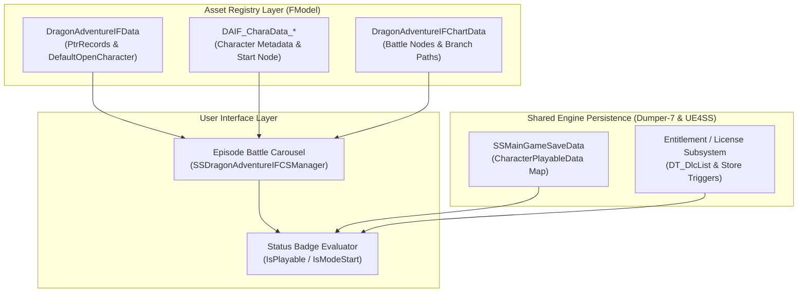

# Episode Battle Subsystem (`DragonAdventureIF`): Technical Architecture & Diagnostic Dossier

> **Status:** ACTIVE RESEARCH DOSSIER  
> **Subsystem Domain:** `DragonAdventureIF` (`SSDragonAdventureIFCSManager`, `DAIF_*`)  
> **Target Game:** *Dragon Ball: Sparking! ZERO* (Unreal Engine 5.1.1)  
> **Governing Protocol:** [`research_and_diagnostic_rulebook.md`](../../../research_and_diagnostic_rulebook.md)  
> **Epistemic Invariant:** Receipts-First Extraction via FModel, Dumper-7, and UE4SS Live GUI Console.

---

## 1. Executive Overview

In *Dragon Ball: Sparking! ZERO*, the single-player cinematic story mode is architecturally isolated within the **`DragonAdventureIF`** engine subsystem.

This subsystem is responsible for:
1. **The Carousel & Master Registry:** Managing the selection ring of character sagas, displaying unlock status, and tracking active selection.
2. **The Flowchart Graph System:** Evaluating story progression nodes, branching what-if pathways, and battle triggers.
3. **Character Story Metadata:** Storing narrative metadata, banners, portraits, and mission parameters for each saga.
4. **Integration with Shared Engine Systems:** Interfacing with the persistent save data system (`SSMainGameSaveData`), the entitlement/DLC validation subsystem, and the Unreal Engine DataAsset registry.

---

## 2. Documentation Architecture

To maintain modularity and avoid monolithic documentation rot, the architecture of `DragonAdventureIF` is organized into five discrete domain documents:

```
docs/research/episode-battle-subsystem/
├── README.md                           <-- Subsystem Overview & Navigation Index (This Document)
├── 01-asset-hierarchy-and-schemas.md   <-- Registries, Carousel, Flowcharts & Character DataAssets
├── 02-cpp-manager-and-lifecycle.md     <-- SSDragonAdventureIFCSManager, Functions & Memory Offsets
├── 03-save-data-interface.md           <-- SSMainGameSaveData, CharacterPlayableData & Persistence
├── 04-entitlements-and-dlc-system.md   <-- Licensing, Steam Store Modal Triggers & DlcKeys
├── 05-custom-saga-runbook.md           <-- Master Synthesis: The Step-by-Step Integration Checklist
├── 06-isplayable-dissection-and-mechanics.md <-- Definitive IsPlayable Disassembly, 3-Tier Hierarchy & UI Callers
├── 07-custom-saga-key-mechanics-and-dispatch.md <-- Machine-Level Disassembly of All 6 Callers & Character Asset Layout
├── 08-carousel-name-resolution-and-binding.md   <-- Disassembly of Button Text Updater, Recycling Bypass & Localization
└── 09-carousel-population-and-array-allocation.md <-- Carousel Allocation, Array Sizing & Population Mechanics
```

---

## 3. Subsystem Dependency & Data Flow



---

## 4. Domain Document Index

| Document | Primary Tool | Scope & Core Responsibilities |
|---|---|---|
| **[`01-asset-hierarchy-and-schemas.md`](01-asset-hierarchy-and-schemas.md)** | **FModel** + `.usmap` | Master registry property trees, `PtrRecords` carousel format, flowchart node definitions, and field-by-field diff between Vanilla Goku (`0000_40`) and Complete Story (`0000_00`). |
| **[`02-cpp-manager-and-lifecycle.md`](02-cpp-manager-and-lifecycle.md)** | **Dumper-7** | C++ class layouts, member variable byte offsets, bitfields, function signatures (`IsPlayable`, `IsModeStart`), and native execution thunk addresses in shipping memory. |
| **[`03-save-data-interface.md`](03-save-data-interface.md)** | **Dumper-7** + **UE4SS GUI** | Memory layout of `SSMainGameSaveData` and `CharacterPlayableData`, live RAM snapshots on fresh save, and analysis of why runtime map mutations failed in Lua. |
| **[`04-entitlements-and-dlc-system.md`](04-entitlements-and-dlc-system.md)** | **FModel** + **Dumper-7** | Investigation of DLC license checks, Steam store modal trigger mechanisms, and auditing DataTables (`DT_DlcList`, `DT_CharacterDlc`) for custom character keys. |
| **[`05-custom-saga-runbook.md`](05-custom-saga-runbook.md)** | **Synthesis** | The definitive, actionable, step-by-step checklist to register, unlock, and launch any custom Episode Battle saga, citing verified receipts from docs 01–04. |
| **[`06-isplayable-dissection-and-mechanics.md`](06-isplayable-dissection-and-mechanics.md)** | **MSVC dumpbin** + **Disassembly** | Exhaustive machine code disassembly of `IsPlayable`, revealing the 3-tier hierarchy, Tier 3 save query engine (`0x2510ED0`), the UI carousel widget builder (`0x24F602D`), and why prior hooks failed. |
| **[`07-custom-saga-key-mechanics-and-dispatch.md`](07-custom-saga-key-mechanics-and-dispatch.md)** | **MSVC dumpbin** + **Binary Analysis** | Disassembly of all 6 callers of Tier 3, proving dynamic array bounds without 12-slot limit, and full 364-byte decoding of `DAIF_CharaData`. |
| **[`08-carousel-name-resolution-and-binding.md`](08-carousel-name-resolution-and-binding.md)** | **MSVC dumpbin** + **PE Scanner** | Forensic disassembly of Button Text Updater (`0x14447AF30`), proving the recycling bypass guard skipping `SetText`, and full localization reference map. |
| **[`09-carousel-population-and-array-allocation.md`](09-carousel-population-and-array-allocation.md)** | **MSVC dumpbin** + **UAssetGUI** | Disassembly of CSManager active slot controller (`0x1424EF6D0`), array population (`0x1424F8B2F`), ground-truth non-contiguous inventory, and proving why recycled Slate widgets retain prior names. |

