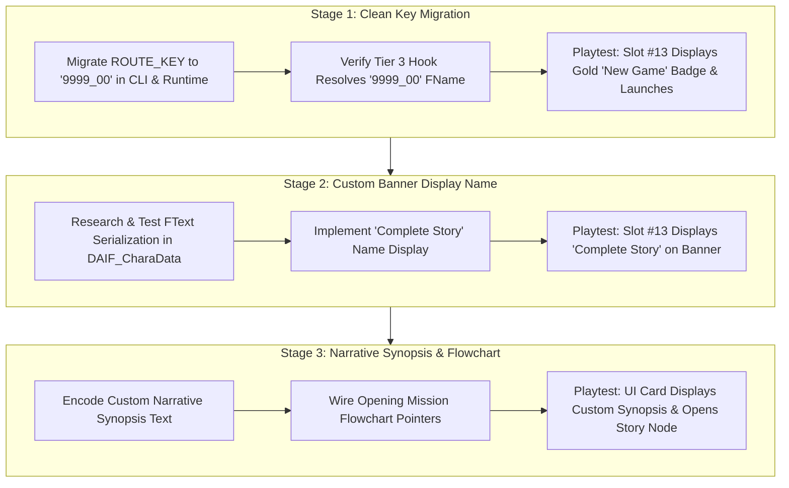

# Custom Saga Identity Lifecycle Roadmap

> **Status:** ACTIVE MILESTONE ROADMAP  
> **Target Subsystem:** `DragonAdventureIF` Custom Identity, Asset Localization & Flowchart Routing  
> **Prerequisite:** Tier 3 Save Query Detour Verified (`IsCharacterPlayableInSave` at RVA `0x2510ED0`)  
> **Preceding Roadmaps:** [`episode-battle-playability.md`](episode-battle-playability.md)  

---

## 1. Goal and Scope

Transition the verified, unlocked Proof of Concept (PoC) Episode Battle slot #13 from duplicate Goku test assets to the official, permanent **Complete Story** identity.

To maintain strict diagnostic boundaries and adhere to the **Single-Variable Testing Principle**, the work is decomposed into three isolated, independently verifiable stages:
1. **Stage 1:** Clean Key Migration (`9999_00`) — Register, unlock, and launch via the dedicated 7-character key.
2. **Stage 2:** Custom Carousel Display Name — Render "Complete Story" on the banner (replacing "Goku").
3. **Stage 3:** Custom Narrative Synopsis & Mission Link — Render custom campaign story text and wire opening event flow.

Each stage requires its own receipt-backed research, explicit intent alignment with the user, focused implementation plan, and in-game playtest verification before progressing to the next stage.

---

## 2. Evidence Baseline

* `[FACT]`: In the 2026-10-07 playtest (verified via screenshot `media_1791347270071.jpg`), slot #13 rendered with the **Gold "New Game" badge** (`edx = 1`) and launched successfully without triggering the Steam DLC modal.
* `[FACT]`: Disassembly in [`06-isplayable-dissection-and-mechanics.md`](../research/episode-battle-subsystem/06-isplayable-dissection-and-mechanics.md) proved that the UI Carousel Widget Builder (`UpdateCarouselPanel` at RVA `0x24F602D`) calls Tier 3 `IsCharacterPlayableInSave` (`0x2510ED0`) directly with the character's `FKoratCharacterDataList` key pointer (`rcx = &Character->CharacterKey`).
* `[FACT]`: Engine convention across `DragonAdventureIFData.uasset`, `DragonAdventureIFChartData.uasset`, and C++ code strictly expects a 7-character string formatted as `XXXX_YY` (4 numeric digits, underscore, 2 numeric digits). Character prefixes (e.g. `CS0001`) violate engine conventions and risk parsing mismatches.
* `[OBSERVATION]`: In the verified PoC playtest, slot #13 displayed the title **"Goku"** on its carousel banner.
* `[FACT]`: Binary inspection of `DAIF_CharaData_0000_00.json` (`Exports[0].Data`) revealed that the character name is serialized as an `FText` with `ETextHistoryType::StringTableEntry` (byte `0x0B`) pointing to:
  - String Table: `/Game/SS/StringTables/Event/ST_ADIF_CHR_NAME`
  - Key: `ST_ADIF_CHR_NAME_0000_00`
  - Synopsis Key: `ST_ADIF_SYNOPSIS_00_0_99`
  Because the test borrowed route key `0000_00`, the engine resolved `ST_ADIF_CHR_NAME_0000_00` to the stock string "Goku".
* `[FACT]`: In Unreal Engine 5.1, querying a non-existent StringTable key via `FTextHistory_StringTableEntry` returns the literal key string (e.g. `<ST_ADIF_CHR_NAME_9999_00>`), rather than a user-friendly name.

---

## 3. The 3-Stage Lifecycle Roadmap

---

### Stage 1: Clean Key Migration (`9999_00`)

* **Primary Subsystem:** Save Data & Registry Subsystem (`PtrRecords`, `FName` resolution, MinHook detour).
* **Objective:** Replace temporary test key `0000_00` with official mod key `9999_00`.
* **Execution Plan:**
  1. Update `crates/complete-story-cli/src/transform/registry.rs`: `ROUTE_KEY = "9999_00"`.
  2. Update `crates/complete-story-cli/src/transform/chart.rs`: `ROUTE_KEY = "9999_00"`.
  3. Update `crates/complete-story-runtime/src/lib.rs`: Asynchronously resolve `FName` for `"9999_00\0"`.
  4. Clean up `CompleteStory/scripts/main.lua` to remove deprecated RAM injection code.
  5. Build, pack, and deploy container via `complete-story-cli`.
* **Exit Gate (Verification):**
  - All automated unit tests in `complete-story-cli` pass (`cargo test`).
  - In `CompleteStoryRuntime.log`, `FName` for `9999_00` resolves on attempt 1.
  - In Sparking! ZERO, slot #13 displays the **Gold "New Game" badge** (`edx = 1`) and launches without the Steam DLC popup.

---

### Stage 2: Custom Carousel Display Name ("Complete Story")

* **Primary Subsystem:** Asset Localization & UI Text Rendering (`FText` serialization, String Table bridging).
* **Objective:** Replace the duplicate "Goku" title on slot #13 banner with **"Complete Story"**.
* **Research Focus (Game Engine Dissection & 06 Protocol):**
  - **Native Engine Functions & RVAs:** Trace the carousel button updater (`0x1424F6060`), character data getter (`0x144460E40`), and text-binding caller in `SparkingZERO-Win64-Shipping.exe`.
  - **String Table Resolution:** Disassemble how the engine queries `/Game/SS/StringTables/Event/ST_ADIF_CHR_NAME` and determine why recycled widgets retain previous labels when an entry is unmapped.
  - **Binary Payload Layout:** Dissect the unversioned `FText` payload at `Exports[0].Data` offset `0x08`–`0x31` in `SSDragonAdventureIFCharacterDataAsset`.
  - **Reference Guide Deliverable:** Author [`08-carousel-name-resolution-and-binding.md`](../research/episode-battle-subsystem/08-carousel-name-resolution-and-binding.md) as the authoritative game engine reference guide before authoring the Stage 2 implementation plan.
* **Exit Gate (Verification):**
  - Slot #13 banner explicitly reads **"Complete Story"** in the game UI.
  - Vanilla character names (slots 1–12) remain 100% unaltered.

---

### Stage 3: Custom Narrative Synopsis & Starting Flowchart

* **Primary Subsystem:** Narrative Mission Flowchart & UI Information Card (`ST_ADIF_SYNOPSIS`, `DIF_Event`, `EventBlock`).
* **Objective:** Display custom story synopsis on the right-hand character overview panel and route chapter start to the custom opening event.
* **Research Focus (Game Engine Dissection & 06 Protocol):**
  - **Native Engine Functions & RVAs:** Disassemble the native synopsis card loader and opening event transition dispatcher in `SparkingZERO-Win64-Shipping.exe`.
  - **Asset Schemas & String Tables:** Map `ST_ADIF_SYNOPSIS` string table references and `DragonAdventureIFChartData` node linkages in vanilla game assets.
  - **Reference Guide Deliverable:** Author dedicated research document in `docs/research/episode-battle-subsystem/` before authoring the Stage 3 implementation plan.
* **Exit Gate (Verification):**
  - Character select overview panel displays the custom Complete Story synopsis.
  - Chapter start proceeds to the custom introductory battle sequence.

---

## 4. Safety & Stop Rules

1. **Single-Variable Rule:** An agent must never modify text encoding (Stage 2) or flowchart pointers (Stage 3) while working on Key Migration (Stage 1). Each stage must be isolated and verified.
2. **Clean Working Tree Invariant:** Dirty uncommitted changes must never be left across turns. Each completed, playtested stage must be committed and pushed to `origin main` before advancing.
3. **Save File Protection:** Under no circumstances may code write unmapped keys to `MainGameSaveData.sav` or disk. All unlock states must be served transiently in RAM via the proven Tier 3 hook.
4. **Code Limit:** Strictly `<= 300` lines per code file (`.rs`, `.lua`).
